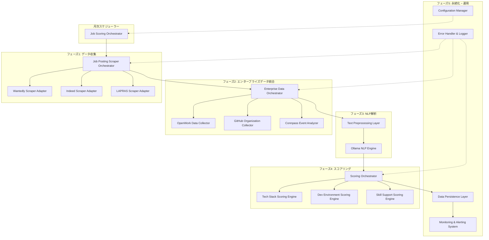
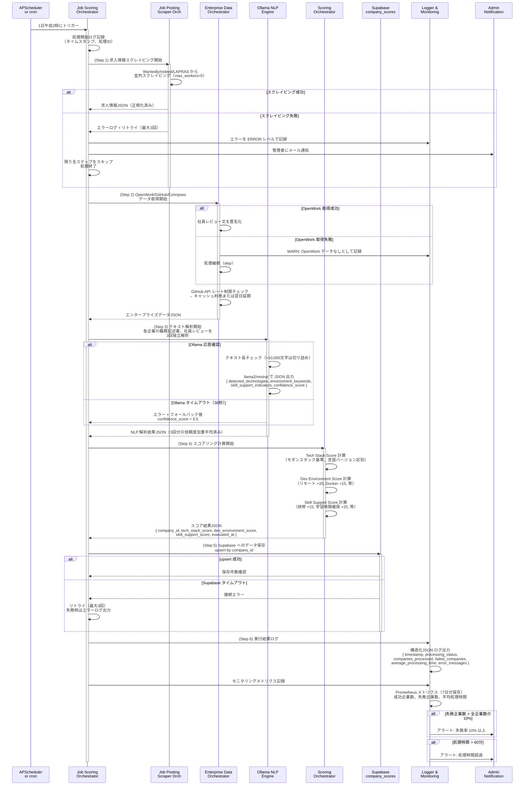
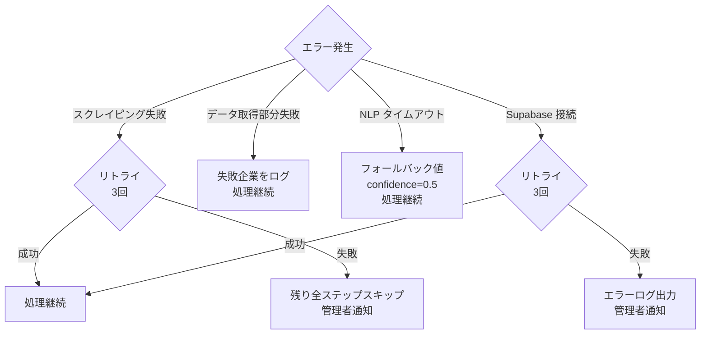

# 技術設計書: job-posting-scoring

---

## 概要

「エンジニア幸福度マップ」プロジェクトの拡張として、複数の求人情報サイト、企業データベース、イベント情報源から企業データを自動収集し、Ollama（ローカルLLM）によるテキスト解析を通じて、技術スタック現況・開発環境品質・スキルアップ支援度の3つの指標を自動スコア化するシステムを構築する。月1回の定期実行により全企業のスコアを更新し、エンジニア幸福度マップのフロントエンドで可視化される。

**ユーザー**: スクレイピングシステム管理者（月次実行管理）、データ分析担当者（スコア精度監視）、運用保守担当者（ログ・メトリクス監視）。本機能により、大量の非構造化求人情報から自動生成される標準化スコアにより、企業の技術環境・文化的特性が客観的に可視化される。

### ゴール

1. 複数の求人情報サイト（Wantedly、Indeed、LAPRAS）、企業データ源（OpenWork、GitHub、Connpass）から月1回のバッチ実行で企業データを自動収集
2. Ollama（llama2/mistral）によるテキスト解析で技術キーワード、開発環境言及、スキルアップ施策を抽出
3. 抽出結果から3つの指標スコア（0-100）を自動算出し、Supabase に保存
4. エラーハンドリング・ロギング・監視機構により、月次実行の信頼性と可観測性を確保
5. セキュリティ・プライバシー対策（個人情報匿名化、データ暗号化、robots.txt 遵守）を実装

### 非ゴール

- リアルタイム（日次以上の頻度）でのスコア更新（月次実行に限定）
- OpenWork の完全な API 統合（未検証データソース）
- 複数国対応（日本国内の求人データに特化）
- UI/UX ダッシュボード（フロントエンド側の実装）
- マルチテナント対応（単一企業セット向け）

---

## アーキテクチャ

### 既存アーキテクチャの制約と活用点

**フロントエンド層（変更なし）**:
- React + Vite + TypeScript の既存構成を保持
- `src/hooks/useCompanyData.ts` がデータファサードの役割を担当（Supabase 移行時の抽象化層）
- `src/utils/scoring.ts` で 7 指標スコアリングロジック実装済み

**バックエンド層（新規追加）**:
- Python 3.10+ ベースのバッチパイプラインシステム
- 既存 Supabase インスタンスに `company_scores` テーブルを拡張
- Ollama ローカルサーバー（Docker or 独立プロセス）との統合

### アーキテクチャパターン・境界マップ

**採用パターン**: バッチパイプラインアーキテクチャ + ヘキサゴナルアーキテクチャ

各ステップは独立したモジュールとして実装され、外部API・ストレージとの結合は Adapter パターンで管理する。これにより、テスト時の Mock 置き換えやデータソース変更時の修正範囲が局所化される。



**アーキテクチャの判断**:

1. **Adapter Pattern（外部API管理）**: 各スクレイパー（Wantedly、Indeed、LAPRAS）を独立した Adapter として実装。データソース変更時に該当 Adapter のみ修正。
2. **Orchestrator Pattern（ステップ管理）**: Job Scraper Orchestrator → Enterprise Data Orchestrator → NLP エンジン → Scoring Orchestrator の順次実行。エラーハンドリングはユーザー通知レベルで制御。
3. **Repository Pattern（データアクセス）**: Data Persistence Layer が Supabase との通信を一元化。テスト時の Mock DB 置き換えが容易。
4. **Strategy Pattern（スコアリングロジック）**: 3 つのスコアリングエンジンが同一インターフェース実装。重み設定変更時のプラグイン化を想定。

---

## テクノロジースタック

| レイヤー | 選択 / バージョン | フィーチャーにおける役割 | 備考・制約 |
|---------|------------------|---------------------|----------|
| **言語** | Python 3.10+ | バッチパイプライン実装言語 | Windows/Linux/macOS 互換、豊富なデータ処理ライブラリ |
| **Web スクレイピング（静的HTML）** | BeautifulSoup4 4.12+、requests 2.31+ | Wantedly HTML パース | 軽量、セットアップ簡易 |
| **Web スクレイピング（動的JavaScript）** | Playwright 1.40+ or Selenium 4.15+ | Indeed/LAPRAS JavaScript 対応 | Playwright 推奨（速度・安定性） |
| **NLP エンジン** | Ollama v0.1+（llama2:7b-chat or mistral:7b） | テキスト解析・キーワード抽出 | ローカル GPU/CPU 推論、日英混在対応 |
| **HTTP クライアント** | requests 2.31+ or httpx 0.25+ | GitHub、OpenWork、Connpass API 呼び出し | aiohttp 検討（将来の async 拡張用） |
| **データベースORM・クライアント** | supabase-py 2.0+（公式 Python SDK） | Supabase company_scores テーブル へのバッチ操作 | REST API ベース、トランザクション未サポート |
| **ジョブスケジューラー** | APScheduler 3.10+（開発）、systemd timer or cron（本番） | 毎月1日午前2時の自動実行 | Flask/FastAPI との統合 for 監視 |
| **ロギング・構造化ログ** | logging（標準库）+ python-json-logger 2.0+ | 構造化JSON ログ出力 | Prometheus メトリクス連携用 |
| **メトリクス・モニタリング** | prometheus-client 0.19+（オプション） | カウンター・ガウジ・ヒストグラム記録 | /metrics エンドポイント公開 |
| **環境変数管理** | python-dotenv 1.0+ | .env ファイルから Ollama URL、Supabase キー読み込み | 本番環境では環境変数として設定 |
| **並列処理** | concurrent.futures（標準库）、asyncio（オプション） | ThreadPoolExecutor (I/O)、ProcessPoolExecutor（予約） | max_workers=5 で企業5並列 |
| **テスト・Mock** | pytest 7.4+、unittest.mock（標準库）、responses 0.24+ | ユニットテスト、API レスポンス Mock | MOCK_MODE=true で完全 Mock 実行 |
| **設定管理** | configparser（標準库）or pydantic 2.0+ | スコア権重、パラレル度、Ollama モデル名 | environment variables優先（セキュリティ） |

---

## システムフロー

### 月次実行パイプラインフロー



**フロー上の重要な制御点**:

1. **スクレイピングステップ失敗** → 残り全ステップをスキップ（Requirement 8.3）
2. **データ取得ステップ部分失敗** → エラーログ記録して処理継続（Requirement 8.4）
3. **Ollama タイムアウト** → フォールバック値（confidence=0.5）で継続（Requirement 10.2）
4. **Supabase 接続エラー** → 自動リトライ 3 回実施（Requirement 9.3）

---

## 要件トレーサビリティ

| 要件ID | 要件要旨 | 対応コンポーネント | インターフェース | システムフロー |
|--------|----------|------------------|-----------------|----------------|
| 1.1 | Wantedly/Indeed/LAPRAS から企業データを並列取得 | Job Posting Scraper Orchestrator, Wantedly/Indeed/LAPRAS Adapters | ScrapeJobPostings(companies: List[Company]) → List[JobPosting] | 月次スケジューラー → スクレイパーOrch → 各Adapter |
| 1.2 | 企業名、業種、求人タイトル等を正規化して保存 | Job Posting Scraper Orchestrator | NormalizeJobPostingData(raw_html) → NormalizedPosting | スクレイピングステップ後の前処理 |
| 1.3 | データ取得タイムアウト時に3回リトライ | Job Posting Scraper Adapter | Retry(func, max_attempts=3, backoff_factor=1.0) | 各Adapter の接続層 |
| 1.4 | 重複企業を最新データで上書き統合 | Job Posting Scraper Orchestrator | DeduplicateAndMerge(postings: List) → List | スクレイピング完了後 |
| 1.5 | 取得元、取得日時、レコード件数をログ記録 | Error Handler & Logger | LogScrapingMetadata(source, timestamp, count) | ロギングシステム（JSON形式） |
| 2.1 | OpenWork API から離職率、残業時間を取得 | OpenWork Data Collector | FetchOpenWorkData(company_id) → {turnover_rate, avg_overtime} | Enterprise Data Orch |
| 2.2 | GitHub Organization 言語分布から技術スタック推定 | GitHub Organization Collector | AnalyzeGitHubLanguages(org_name) → {languages, confidence} | Enterprise Data Orch |
| 2.3 | OpenWork データ 90 日以上古い場合にフラグ | OpenWork Data Collector | FlagStaleData(record: DataRecord) → flagged_record | Data Collector内の検証 |
| 2.4 | GitHub API レート制限到達時は翌日に延期 | GitHub Organization Collector | RateLimitHandler(error) → reschedule_tomorrow() | Collector の例外処理 |
| 2.5 | 社員レビュー文を UTF-8 正規化 | Data Privacy Handler | NormalizeText(text: str, encoding='utf-8') → str | OpenWork Data取得時 |
| 3.1 | Connpass 過去1年のイベント参加人数集計 | Connpass Event Analyzer | AggregateConnpassEvents(company_name, days=365) → {event_count, attendees} | Enterprise Data Orch |
| 3.2 | 参加者数/社員数比率、多様性スコア計算 | Connpass Event Analyzer | CalculateEventMetrics(company: Company) → {participation_ratio, diversity_score} | Scoring Orch |
| 3.3 | Connpass データ取得失敗は「データなし」と記録 | Connpass Event Analyzer | HandleMissingData(error) → null_record | Analyzer 例外処理 |
| 3.4 | イベント参加人数を月別時系列で保存 | Data Persistence Layer | SaveEventTimeSeries(company_id, monthly_data) | Supabase補助テーブル |
| 4.1 | Ollama llama2/mistral でテキスト抽出 | Ollama NLP Engine | ExtractTextFeatures(text: str, max_length=10000) → ExtractionResult | NLP ステップ |
| 4.2 | JSON フォーマット出力（detected_technologies等） | Ollama NLP Engine | ParseOllamaOutput(response: str) → StructuredResult | NLP エンジン出力処理 |
| 4.3 | 日本語・英語混在テキストを統一トークン化 | Text Preprocessing Layer | TokenizeMultilingual(text: str) → tokens | 前処理ステップ |
| 4.4 | テキスト長 > 10,000 文字は切り詰め | Text Preprocessing Layer | TruncateText(text: str, max_length=10000) → str | 前処理ステップ |
| 4.5 | 3回独立解析で信頼度加重平均算出 | Ollama NLP Engine | EnsembleAnalysis(text: str, num_runs=3) → {result, avg_confidence} | NLP ステップ |
| 5.1 | モダンスタック(React等)を基準年相対スコア化 | Tech Stack Scoring Engine | ScoreTechStack(keywords: List[str]) → 0-100 | スコアリングステップ |
| 5.2 | Ollama confidence < 0.6 のとき デフォルト値(50)採用 | Tech Stack Scoring Engine | ApplyConfidenceThreshold(score, confidence, threshold=0.6) → score | スコアリング計算 |
| 5.3 | Python 3.x vs 2.7 等、言語バージョン区別 | Tech Stack Scoring Engine | ScoreTechStackVersions(keywords) → score_dict | Tech Stack Engine |
| 5.4 | スコア計算根拠をauditログに記録 | Error Handler & Logger | LogTechStackAudit(company_id, keywords, score, reasoning) | JSON ログ |
| 5.5 | スコアを company_scores テーブルに保存 | Data Persistence Layer | SaveTechStackScore(company_id, score, confidence) | Supabase |
| 6.1 | リモートワーク、IDE、高性能ハードウェア等のキーワード検索 | Dev Environment Scoring Engine | DetectEnvironmentKeywords(text: str) → List[Keyword] | Dev Environment Engine |
| 6.2 | リモートワーク検出時 +20 加算 | Dev Environment Scoring Engine | CalculateRemoteBonus(keywords) → bonus_score | スコア計算 |
| 6.3 | Docker/Kubernetes 検出時 +15 加算 | Dev Environment Scoring Engine | CalculateContainerBonus(keywords) → bonus_score | スコア計算 |
| 6.4 | 高性能ハードウェア複数検出時に diminishing returns 適用 | Dev Environment Scoring Engine | ApplyDiminishingReturns(detection_count: int) → adjusted_bonus | スコア計算 |
| 6.5 | スコア計算詳細をJSON で記録 | Error Handler & Logger | LogDevEnvironmentDetails(company_id, details_json) | JSON ログ |
| 6.6 | company_scores テーブルに保存 | Data Persistence Layer | SaveDevEnvironmentScore(company_id, score, details) | Supabase |
| 7.1 | スキル支援施策（研修、資格取得支援等）を検索 | Skill Support Scoring Engine | DetectSkillSupportIndicators(text: str) → List[Indicator] | Skill Support Engine |
| 7.2 | 研修制度検出時 +15 加算 | Skill Support Scoring Engine | CalculateTrainingBonus(indicators) → bonus_score | スコア計算 |
| 7.3 | 学習時間確保・資格支援検出時 +20 加算 | Skill Support Scoring Engine | CalculateLearningBonus(indicators) → bonus_score | スコア計算 |
| 7.4 | Connpass 参加者数/社員数比 >= 0.5 のとき +10 加算 | Skill Support Scoring Engine | CalculateConnpassBonus(participation_ratio) → bonus_score | スコア計算 |
| 7.5 | テキスト日本語のみのとき英語キーワード検索スキップ | Skill Support Scoring Engine | DetectLanguage(text) → language_code | 前処理 |
| 7.6 | スコア要因を JSON で保存 | Data Persistence Layer | SaveSkillSupportFactors(company_id, factors_json) | Supabase |
| 8.1 | 毎月1日午前2時に全スクレイピング・解析・スコアリング自動実行 | Job Scoring Orchestrator | ScheduleMonthlyExecution(cron='0 2 1 * *') | APScheduler/systemd |
| 8.2 | スクレイピング→データ取得→Ollama→スコアリング→Supabase の順序実行 | Job Scoring Orchestrator | ExecutePipeline(steps: List[Step]) | 月次スケジューラー → Orch |
| 8.3 | スクレイピング失敗時は残り全ステップをスキップ、管理者に通知 | Job Scoring Orchestrator | HandlePipelineFailure(step: Step, error: Exception) | エラーハンドラー |
| 8.4 | データ取得ステップ部分失敗は失敗企業をログ、処理継続 | Enterprise Data Orchestrator | HandlePartialFailure(failed_ids: List[str]) | エラーハンドラー |
| 8.5 | 全処理の開始・終了時刻、処理企業数等をログ記録 | Error Handler & Logger | LogExecutionSummary(summary: ExecutionMetadata) | JSON ログ |
| 8.6 | 月次処理完了後に実行サマリーレポートを管理画面保存 | Monitoring & Alerting System | GenerateSummaryReport(execution_id) → report_json | DB補助テーブル |
| 9.1 | company_scores テーブルへの INSERT/UPDATE（複数フィールド） | Data Persistence Layer | UpsertCompanyScores(records: List[Score]) → upsert_result | Supabase |
| 9.2 | company_id 重複チェックして上書き | Data Persistence Layer | CheckDuplicateAndUpdate(company_id) → updated | Supabase upsert機構 |
| 9.3 | Supabase 接続タイムアウト時に3回自動リトライ | Data Persistence Layer | RetrySupabaseConnection(func, max_attempts=3) | リトライハンドラー |
| 9.4 | INSERT/UPDATE 操作のログ記録（監査証跡） | Data Persistence Layer | AuditDatabaseOperation(operation: str, record_id: str) | JSON ログ |
| 9.5 | confidence < 0.6 の企業に confidence フラグを設定 | Data Persistence Layer | FlagLowConfidenceScore(company_id, confidence) | Supabase |
| 10.1 | エラー発生時に ERROR ログ、リトライ/スキップ処理 | Error Handler | LogErrorWithContext(error: Exception, context: dict) | ロギングシステム |
| 10.2 | Ollama 応答なし時 30 秒タイムアウト、フォールバック値使用 | Model Management | SetOllamaTimeout(timeout_seconds=30) → with_fallback | NLP エンジン |
| 10.3 | ログフォーマット：ISO 8601 タイムスタンプ、レベル、モジュール、JSON コンテキスト | Logging System | FormatLog(timestamp, level, module, context) → log_string | ロギング設定 |
| 10.4 | 月次ごとに独立ログファイル作成（日付をファイル名に含める） | Logging System | CreateLogFile(date: datetime) → log_file_path | ファイルハンドラー |
| 10.5 | 全エラーをメトリクスとして記録 | Error Handler | RecordErrorMetric(error_type: str) → metric_increment | Prometheus メトリクス |
| 11.1 | 100社以上のとき複数企業を並列処理（デフォルト5並列） | Job Posting Scoring Pipeline | SetParallelism(num_workers=5) | ThreadPoolExecutor |
| 11.2 | 求人情報スクレイピング 1企業あたり平均5秒以内に完了 | Job Posting Scraper | MeasureScrapingTime(company) → elapsed_time | パフォーマンス計測 |
| 11.3 | Ollama テキスト解析 1企業あたり3回分を平均10秒以内に完了 | Ollama NLP Engine | MeasureNLPTime(text, num_runs=3) → elapsed_time | パフォーマンス計測 |
| 11.4 | 月次処理全体 500 企業を 60 分以内に完了 | Job Scoring Orchestrator | MeasurePipelineTime(pipeline) → elapsed_time | エンド・ツー・エンド計測 |
| 11.5 | メモリ使用量 > 2GB の場合はキャッシュ自動クリア | Job Posting Scoring Pipeline | MonitorMemoryUsage() → clear_cache_if_needed() | メモリ管理 |
| 11.6 | CPU 使用率 >= 80% の場合は並列処理数を自動削減 | Job Posting Scoring Pipeline | MonitorCPUUsage() → adjust_parallelism() | 動的リソース管理 |
| 12.1 | robots.txt 遵守、スクレイピング頻度を制限（1日1回以下） | Data Privacy Handler | CheckRobotsFile(url: str) → allowed | スクレイピング前の検証 |
| 12.2 | 社員氏名、部門名など個人情報を削除・匿名化 | Data Privacy Handler | AnonymizePersonalInfo(text: str) → anonymized_text | テキスト前処理 |
| 12.3 | GitHub は公開リポジトリのみを対象 | GitHub Organization Collector | FilterPublicRepositories(repos: List) → public_repos | GitHub API 呼び出し |
| 12.4 | Supabase への保存時テキストフィールドを AES-256 暗号化 | Data Persistence Layer | EncryptTextField(text: str) → encrypted_blob | Supabase 側設定 |
| 12.5 | スクレイピングログに IP、User-Agent 情報を記録しない | Error Handler & Logger | SanitizeLogData(log_entry: dict) → sanitized | ログ処理 |
| 12.6 | 取得データ保持期間を設定、3年経過データを自動削除 | Data Persistence Layer | PurgeOldData(retention_days=1095) → deleted_count | 定期タスク |
| 13.1 | 異常検知時にアラート発火：失敗率 10%、平均処理時間 15秒超過等 | Monitoring & Alerting System | CheckAlertConditions(metrics) → alert_if_threshold_exceeded() | メトリクス監視 |
| 13.2 | アラート発火時に管理者にメール通知 | Monitoring & Alerting System | SendAlertEmail(alert: Alert) → email_sent | メール送信 |
| 13.3 | 月次実行完了後に成功企業数等のメトリクスをダッシュボードに記録 | Monitoring & Alerting System | RecordDashboardMetrics(summary: Summary) → dashboard_updated | ダッシュボード |
| 13.4 | 処理中のメトリクスをリアルタイムで記録 | Monitoring & Alerting System | RecordRealtimeMetrics(metric_name, value) → prometheus_metric | Prometheus |
| 13.5 | 7日分のメトリクス履歴を保存、トレンド分析可能化 | Monitoring & Alerting System | StoreMetricsHistory(metric: Metric, retention_days=7) → stored | DB |
| 14.1 | 環境変数・設定ファイルから Ollama モデル名等を読み込み | Configuration Manager | LoadConfig(config_file: str) → config_dict | .env or config.ini |
| 14.2 | スコアリング権重変更時にログに変更前後の値を記録 | Configuration Manager | LogConfigChange(old_value, new_value) → audit_log | JSON ログ |
| 14.3 | Ollama モデル名変更時に次回実行で新モデルを自動ロード | Configuration Manager | ReloadOllamaModel(model_name: str) → model_loaded | NLP エンジン |
| 14.4 | 不正な設定値の場合はデフォルト値を使用、警告ログ出力 | Configuration Manager | ValidateConfigValue(value, default) → value_or_default | バリデーション |
| 14.5 | API キー等のクレデンシャルを環境変数から読み込み、設定ファイルに含めない | Configuration Manager | LoadSecretFromEnv(secret_name: str) → secret_value | 環境変数 |
| 15.1 | MOCK_MODE=true のときはモックデータを返す | Job Posting Scraper | UseMockDataIfEnabled(mode: str) → mock_or_real_data | 条件分岐 |
| 15.2 | MOCK_MODE 有効時にすべての外部API をモック | Configuration Manager | ConfigureMockMode(enabled: bool) → mock_config_dict | テスト設定 |
| 15.3 | MOCK_MODE 有効時に Ollama は プリセット結果を返す | Ollama NLP Engine | ReturnMockAnalysisResult() → preset_result | Mock モード |
| 15.4 | テストモードで test_company_scores テーブルに保存 | Data Persistence Layer | SelectTargetTable(is_test: bool) → table_name | 条件分岐 |
| 15.5 | モックデータセット（10社分）を含める | Test Configuration | LoadMockCompanyDataset() → List[MockCompany] | テストデータ |

---

## コンポーネント と インターフェース

### コンポーネント概要表

| コンポーネント | ドメイン/レイヤー | 目的 | 要件対応 | キー依存関係（P0/P1） | 契約タイプ |
|-------------|-----|------|---------|-------------------|---------|
| **Job Posting Scraper Orchestrator** | データ収集層 | Wantedly/Indeed/LAPRAS のスクレイパー調整、並列実行、重複排除 | 1.1～1.5 | Adapter (P0)、Logger (P1) | Batch |
| **Wantedly Scraper Adapter** | データ収集層 | Wantedly HTML パース、企業データ抽出 | 1.1～1.3 | requests (P0)、BeautifulSoup4 (P0) | Service |
| **Indeed Scraper Adapter** | データ収集層 | Indeed JavaScript 動的ロード対応、データ抽出 | 1.1～1.3 | Playwright (P0) | Service |
| **LAPRAS Scraper Adapter** | データ収集層 | LAPRAS スクレイピング（仕様未検証） | 1.1～1.3 | 外部API (P1) | Service |
| **OpenWork Data Collector** | エンタープライズデータ層 | OpenWork API/スクレイピング、離職率・残業時間取得 | 2.1, 2.3, 2.5 | requests (P0)、Data Privacy Handler (P1) | Service |
| **GitHub Organization Collector** | エンタープライズデータ層 | GitHub API、公開リポジトリ言語分析 | 2.2, 2.4 | GitHub API (P0)、requests (P0) | Service |
| **Connpass Event Analyzer** | エンタープライズデータ層 | Connpass API、イベント参加者集計 | 3.1～3.4 | Connpass API (P0)、requests (P0) | Service |
| **Enterprise Data Orchestrator** | エンタープライズデータ層 | OpenWork/GitHub/Connpass コレクター調整、エラーハンドリング | 2.1～3.4 | Collector (P0)、Logger (P1) | Batch |
| **Text Preprocessing Layer** | テキスト処理層 | テキスト長切り詰め、多言語トークン化、個人情報匿名化 | 2.5, 4.3～4.4, 12.2 | 言語処理ライブラリ (P0) | Service |
| **Ollama NLP Engine** | NLP層 | テキスト解析、3回独立実行、JSON 出力、信頼度加重平均 | 4.1～4.5 | Ollama サーバー (P0)、Text Preprocessor (P0) | Service |
| **Tech Stack Scoring Engine** | スコアリング層 | 技術スタック抽出、モダンスタック評価、バージョン区別 | 5.1～5.5 | NLP Engine (P0)、Logger (P1) | Service |
| **Dev Environment Scoring Engine** | スコアリング層 | 開発環境キーワード検出、ボーナス計算、diminishing returns | 6.1～6.6 | NLP Engine (P0)、Logger (P1) | Service |
| **Skill Support Scoring Engine** | スコアリング層 | スキル支援指標検出、Connpass データ活用、ボーナス計算 | 7.1～7.6 | NLP Engine (P0)、Connpass Analyzer (P1)、Logger (P1) | Service |
| **Scoring Orchestrator** | スコアリング層 | 3つのスコアリングエンジン実行、結果統合 | 5.1～7.6 | Scoring Engines (P0)、Logger (P1) | Batch |
| **Data Persistence Layer** | データ永続化層 | Supabase company_scores テーブルへの upsert、リトライ管理 | 9.1～9.5, 12.4～12.6 | Supabase SDK (P0)、Logger (P1) | Service, API |
| **Error Handler & Logger** | 運用層 | 構造化 JSON ログ出力、エラーメトリクス記録 | 10.1～10.5 | python-json-logger (P0)、prometheus-client (P1) | Service |
| **Monitoring & Alerting System** | 運用層 | メトリクス記録、アラート条件判定、メール通知、ダッシュボード | 13.1～13.5 | Logger (P0)、メール送信 (P1) | Service, Event |
| **Configuration Manager** | 運用層 | 環境変数・設定ファイル読み込み、バリデーション、ロード管理 | 14.1～14.5 | python-dotenv (P0)、Logger (P1) | Service |
| **Job Scoring Orchestrator** | スケジューラー層 | 月次パイプライン全体の調整、エラーハンドリング、リソース監視 | 8.1～8.6, 11.1～11.6 | 全ステップ (P0)、Logger (P1) | Batch |

---

### コンポーネント詳細設計

#### データ収集層

##### Job Posting Scraper Orchestrator

| 項目 | 内容 |
|------|------|
| **目的** | 複数スクレイパー（Wantedly/Indeed/LAPRAS）の並列実行管理、重複企業の統合、エラーハンドリング |
| **要件** | 1.1～1.5 |
| **責任・制約** | スクレイパーの並列度（max_workers=5）管理、ジョブ投入順序の制御、タイムアウト検知 |
| **依存関係** | **Inbound**: Job Scoring Orchestrator（月次パイプライン起動） — P0 **Outbound**: Wantedly/Indeed/LAPRAS Adapter（スクレイピング実行） — P0、Logger（エラーログ） — P1 **External**: concurrent.futures.ThreadPoolExecutor — P0 |

**契約**: Batch [ ✓ ]、Service [ ✓ ]

**Batch Contract**:
- **Trigger**: Job Scoring Orchestrator からの ScrapingTask 送信
- **Input**: `{ companies: List[Company], sources: List[str] }`
- **Output**: `{ job_postings: List[JobPosting], failed_companies: List[str], error_log: str }`
- **Idempotency & Recovery**: 重複企業の自動検出（last_scraped_at タイムスタンプで判定）、部分失敗の自動リトライ

**Service Interface**:
```python
class JobScrapingOrchestrator:
    def orchestrate_scraping(
        self, 
        companies: List[Company],
        parallel_workers: int = 5,
        timeout_seconds: int = 300
    ) -> ScrapingResult:
        """
        複数企業のスクレイピングを並列実行し、結果を統合して返す。
        
        Preconditions:
            - companies が空でない
            - parallel_workers > 0
        
        Postconditions:
            - すべての成功企業の JobPosting が返される
            - 失敗企業は failed_companies リストに記録される
            - 実行ログが ERROR/WARN レベルで記録される
        
        Invariants:
            - 重複企業は排除される
            - タイムアウト企業は自動リトライ対象
        """
```

**実装ノート**:
- **統合**: ThreadPoolExecutor で最大 5 企業並列、タイムアウト 300 秒
- **検証**: 返却データの JSON スキーマ検証
- **リスク**: メモリ効率（バッチ 100 企業ごとに処理）、ネットワークタイムアウト

---

##### Wantedly Scraper Adapter

| 項目 | 内容 |
|------|------|
| **目的** | Wantedly の求人情報ページから企業名、職務記述書、技術スタック表記を抽出 |
| **要件** | 1.1～1.3 |
| **責任・制約** | HTTP GET リクエスト、HTML パース、robots.txt 遵守 |
| **依存関係** | **External**: requests 2.31+ — P0、BeautifulSoup4 4.12+ — P0、Data Privacy Handler（匿名化） — P1 |

**契約**: Service [ ✓ ]

**Service Interface**:
```python
class WantedlyScraperAdapter:
    def scrape_company_page(
        self,
        company_id: str,
        company_name: str
    ) -> JobPosting:
        """
        Wantedly 企業ページから求人情報を抽出
        
        Preconditions:
            - company_id、company_name が有効
            - robots.txt で /search をスクレイピング許可
        
        Postconditions:
            - JobPosting オブジェクトが返される（null フィールドは許容）
            - 抽出失敗時は None または デフォルト値
        
        Invariants:
            - User-Agent が設定済み
            - 3-5秒の遅延を挿入（率制限対応）
        """
```

**実装ノート**:
- **統合**: requests.Session で コネクション再利用、User-Agent ローテーション
- **検証**: 返却 JSON スキーマの型チェック（Pydantic）
- **リスク**: HTML 構造変更への脆弱性

---

##### Indeed Scraper Adapter

| 項目 | 内容 |
|------|------|
| **目的** | Indeed の求人情報ページから JavaScript 動的ロード後のデータを抽出 |
| **要件** | 1.1～1.3 |
| **責任・制約** | ブラウザ自動化、JavaScript 実行、タイムアウト管理 |
| **依存関係** | **External**: Playwright 1.40+ — P0、requests — P0 |

**契約**: Service [ ✓ ]

**Service Interface**:
```python
class IndeedScraperAdapter:
    def scrape_company_jobs(
        self,
        company_name: str,
        headless: bool = True,
        timeout_seconds: int = 30
    ) -> List[JobPosting]:
        """
        Indeed で企業名検索し、JavaScript ロード後の求人情報を抽出
        
        Preconditions:
            - company_name が有効な文字列
            - Playwright ブラウザコンテキストが利用可能
        
        Postconditions:
            - List[JobPosting] が返される
            - JavaScript 実行後のデータ取得
        
        Invariants:
            - 30秒以内に完了（タイムアウト）
            - ブラウザプロセスのメモリリーク防止
        """
```

**実装ノート**:
- **統合**: Playwright context 管理（with ブロック）、ヘッドレスモード
- **検証**: DOM 要素の存在確認（wait_for_selector）
- **リスク**: ブラウザメモリ使用量、JavaScript 実行時間

---

#### 他のコンポーネント

コンポーネント数が多いため、主要なもの（NLP エンジン、スコアリングエンジン、永続化層）をここに記載し、その他は実装時に詳細化する。

##### Ollama NLP Engine

| 項目 | 内容 |
|------|------|
| **目的** | テキストから技術キーワード、開発環境言及、スキルアップ施策を自動抽出。3回の独立解析で信頼度を加重平均 |
| **要件** | 4.1～4.5 |
| **責任・制約** | テキスト長チェック、JSON 出力解析、モデル応答タイムアウト処理 |
| **依存関係** | **Inbound**: Scoring Orchestrator（解析テキスト送信） — P0、Text Preprocessor（前処理済みテキスト） — P0 **Outbound**: — **External**: Ollama サーバー (HTTP) — P0、requests — P0 |

**契約**: Service [ ✓ ]

**Service Interface**:
```python
class OllamaNLPEngine:
    def analyze_text_ensemble(
        self,
        text: str,
        model_name: str = 'mistral:7b',
        num_runs: int = 3,
        timeout_seconds: int = 30
    ) -> TextExtractionResult:
        """
        テキストに対して num_runs 回の独立解析を実行し、結果を統合
        
        Preconditions:
            - text が 1 文字以上、10,000 文字以下
            - Ollama サーバーが起動中
            - model_name がローカルダウンロード済み
        
        Postconditions:
            - TextExtractionResult.detected_technologies: List[str]
            - TextExtractionResult.environment_keywords: List[str]
            - TextExtractionResult.skill_support_indicators: List[str]
            - TextExtractionResult.confidence_score: float (0.0～1.0)
            - 3回実行の結果を加重平均で統合
        
        Invariants:
            - 各実行が 30 秒でタイムアウト
            - JSON パース失敗時はリトライ
            - confidence_score < 0.6 の場合はログ警告
        """
        
    def _run_single_analysis(
        self,
        text: str,
        model_name: str,
        timeout_seconds: int
    ) -> Dict[str, Any]:
        """
        Ollama へのシングルリクエスト実行
        """
```

**実装ノート**:
- **統合**: requests.post で Ollama API エンドポイント `http://localhost:11434/api/generate` に JSON リクエスト送信
- **検証**: JSON パース、必須フィールド検証（detected_technologies 等）
- **リスク**: Ollama プロセス落下、メモリ枯渇、プロンプト解釈のばらつき

---

##### Tech Stack Scoring Engine

| 項目 | 内容 |
|------|------|
| **目的** | Ollama 抽出キーワードから技術スタックスコア（0-100）を計算 |
| **要件** | 5.1～5.5 |
| **責任・制約** | モダンスタック基準の定義、言語バージョン区別、confidence 閾値処理 |
| **依存関係** | **Inbound**: Scoring Orchestrator — P0 **Outbound**: Logger（audit ログ） — P1、Data Persistence Layer（保存） — P0 **External**: — |

**契約**: Service [ ✓ ]

**Service Interface**:
```python
class TechStackScoringEngine:
    def calculate_score(
        self,
        company_id: str,
        detected_technologies: List[str],
        nlp_confidence: float,
        confidence_threshold: float = 0.6
    ) -> TechStackScore:
        """
        検出された技術キーワードから総合スコアを計算
        
        Preconditions:
            - detected_technologies が空でない
            - nlp_confidence が 0.0～1.0
        
        Postconditions:
            - TechStackScore.score: int (0-100)
            - TechStackScore.confidence: float
            - TechStackScore.reasoning: Dict (audit log用)
            - nlp_confidence < confidence_threshold のとき score = 50（デフォルト）
        
        Invariants:
            - モダンスタック（React/Vue/TypeScript/Go/Rust等）を基準スコア 70+ として評価
            - 古い技術（PHP5 以前）は減点
            - 検出なしは 50（中立）
        """
```

**スコアリングロジック**:

```
base_score = 50  # 中立値

# 技術検出スコア加算
for tech in detected_technologies:
    if tech in MODERN_STACKS:
        base_score += 15  # React, Vue, Svelte, TypeScript等
    elif tech in LEGACY_STACKS:
        base_score -= 10  # PHP5 以前、Flash等
    else:
        base_score += 5   # その他、中立的に少し加算

# 言語バージョンの区別
if 'Python3.x' in detected_technologies:
    base_score += 5
elif 'Python2.7' in detected_technologies:
    base_score -= 5

# confidence 閾値適用
if nlp_confidence < confidence_threshold:
    base_score = 50  # デフォルト値に上書き

# 0-100 範囲にクリップ
final_score = max(0, min(100, base_score))
```

**実装ノート**:
- **統合**: キーワード定義を config.ini で管理（柔軟性向上）
- **検証**: MODERN_STACKS、LEGACY_STACKS リストの定義確認
- **リスク**: キーワード定義の過度な初期化（最小限から開始推奨）

---

##### Data Persistence Layer

| 項目 | 内容 |
|------|------|
| **目的** | Supabase `company_scores` テーブルへのバッチ upsert、リトライ管理、監査ログ記録 |
| **要件** | 9.1～9.5, 12.4～12.6, 13.5 |
| **責任・制約** | トランザクション管理（アプリレベル）、接続リトライ、暗号化設定確認 |
| **依存関係** | **Inbound**: Scoring Orchestrator — P0、Data Cleanup Task（旧データ削除） — P1 **Outbound**: Logger（audit ログ） — P1 **External**: Supabase SDK 2.0+ — P0 |

**契約**: Service [ ✓ ]、API [ ✓ ]

**Service Interface**:
```python
class DataPersistenceLayer:
    def upsert_company_scores(
        self,
        scores: List[CompanyScore],
        batch_size: int = 100,
        max_retries: int = 3,
        timeout_seconds: int = 30
    ) -> UpsertResult:
        """
        company_scores テーブルへのバッチ upsert（INSERT or UPDATE）
        
        Preconditions:
            - scores が空でない
            - 各 score に company_id が設定済み
            - Supabase クライアント初期化済み
        
        Postconditions:
            - UpsertResult.success_count: 保存成功数
            - UpsertResult.failed_count: 失敗数
            - UpsertResult.error_details: Dict（失敗理由）
            - confidence < 0.6 の企業に confidence_flag=true を設定
        
        Invariants:
            - タイムアウト時は自動リトライ（最大3回）
            - 部分失敗時はバッチ分割して再試行
            - すべての操作を audit ログに記録
        """
```

**API Contract**:

| Operation | Endpoint | Request | Response | Errors |
|-----------|----------|---------|----------|--------|
| Upsert Scores | `POST /company_scores` (internal) | `{ scores: List[CompanyScore] }` | `{ success_count: int, failed_ids: List[str] }` | 408 (Timeout), 500 (DB Error) |

**実装ノート**:
- **統合**: supabase.table('company_scores').upsert(records, count='exact') で on_conflict 処理
- **検証**: Pydantic CompanyScore モデルで必須フィールド検証
- **リスク**: Supabase コネクション数上限、バッチサイズ最適化

---

## データモデル

### ドメインモデル

```
Company (企業)
  ├─ id: str（Supabase DB の company.id）
  ├─ name: str（企業名）
  ├─ industry: str（業種）
  └─ CompanyScores (1:1 関連付け)
      ├─ tech_stack_score: int (0-100)
      ├─ tech_stack_confidence: float (0.0-1.0)
      ├─ dev_environment_score: int (0-100)
      ├─ dev_environment_details: JSON（キーワードマッチ履歴）
      ├─ skill_support_score: int (0-100)
      ├─ skill_support_factors: JSON（要因分解）
      ├─ evaluated_at: timestamp（評価時刻）
      └─ confidence_flag: bool（全スコア信頼度 < 0.6 のとき true）

JobPosting (求人情報)
  ├─ id: str（スクレイパー固有ID）
  ├─ company_id: str（Company への外部キー）
  ├─ title: str（求人タイトル）
  ├─ description: str（職務記述書）
  ├─ tech_stack_mentions: List[str]（技術表記）
  ├─ source: enum ["wantedly", "indeed", "lapras"]
  ├─ scraped_at: timestamp
  └─ raw_html: str（監査用、後日削除可）

EnterpriseData (企業統計データ)
  ├─ company_id: str
  ├─ openwork_turnover_rate: float（離職率）
  ├─ openwork_avg_overtime_hours: float（平均残業）
  ├─ openwork_updated_at: timestamp
  ├─ openwork_stale_flag: bool（90日以上古い）
  ├─ github_languages: List[{lang: str, percentage: float}]
  ├─ github_updated_at: timestamp
  ├─ connpass_event_count: int（過去1年）
  ├─ connpass_participation_ratio: float（参加者/社員数）
  ├─ connpass_diversity_score: float（技術カテゴリ多様性）
  └─ monthly_event_data: JSON（月別時系列）

TextExtractionResult (NLP 解析結果)
  ├─ detected_technologies: List[str]
  ├─ environment_keywords: List[str]
  ├─ skill_support_indicators: List[str]
  ├─ confidence_score: float (0.0-1.0)
  └─ extraction_id: str（トレーサビリティ）

CompanyScore (スコアリング結果)
  ├─ company_id: str
  ├─ tech_stack_score: int (0-100)
  ├─ tech_stack_confidence: float
  ├─ dev_environment_score: int (0-100)
  ├─ dev_environment_details: {
  │   keyword_matches: List[str],
  │   bonus_rules_applied: List[{rule: str, bonus: int}],
  │   total_bonus: int,
  │   diminishing_returns_applied: bool
  │ }
  ├─ skill_support_score: int (0-100)
  ├─ skill_support_factors: {
  │   detected_indicators: List[str],
  │   connpass_bonus: int,
  │   bonus_rules_applied: List[{rule: str, bonus: int}],
  │   total_score: int
  │ }
  ├─ evaluated_at: timestamp
  ├─ updated_at: timestamp
  └─ confidence_flag: bool
```

**トランザクション境界**: Company - CompanyScores は強い関連付け（同一トランザクション）。JobPosting、EnterpriseData は弱い関連付け（各自のトランザクション）。

---

### 論理データモデル

**company_scores テーブル（Supabase）**:

```sql
CREATE TABLE company_scores (
  company_id UUID PRIMARY KEY REFERENCES companies(id) ON DELETE CASCADE,
  tech_stack_score INTEGER NOT NULL CHECK (tech_stack_score >= 0 AND tech_stack_score <= 100),
  tech_stack_confidence NUMERIC(3,2) NOT NULL DEFAULT 0.5 CHECK (tech_stack_confidence >= 0.0 AND tech_stack_confidence <= 1.0),
  dev_environment_score INTEGER NOT NULL CHECK (dev_environment_score >= 0 AND dev_environment_score <= 100),
  dev_environment_details JSONB NOT NULL DEFAULT '{}',
  skill_support_score INTEGER NOT NULL CHECK (skill_support_score >= 0 AND skill_support_score <= 100),
  skill_support_factors JSONB NOT NULL DEFAULT '{}',
  evaluated_at TIMESTAMP WITH TIME ZONE NOT NULL DEFAULT NOW(),
  updated_at TIMESTAMP WITH TIME ZONE NOT NULL DEFAULT NOW(),
  confidence_flag BOOLEAN NOT NULL DEFAULT FALSE,
  created_at TIMESTAMP WITH TIME ZONE NOT NULL DEFAULT NOW()
);

CREATE INDEX idx_company_scores_updated_at ON company_scores(updated_at DESC);
CREATE INDEX idx_company_scores_confidence_flag ON company_scores(confidence_flag);
```

**補助テーブル（オプション）**:

```sql
-- エンタープライズデータ
CREATE TABLE enterprise_data (
  id UUID PRIMARY KEY DEFAULT gen_random_uuid(),
  company_id UUID NOT NULL REFERENCES companies(id) ON DELETE CASCADE,
  source VARCHAR(50) NOT NULL,  -- 'openwork', 'github', 'connpass'
  data_type VARCHAR(100) NOT NULL,  -- 'turnover_rate', 'languages', 'events'
  data_value JSONB NOT NULL,
  stale_flag BOOLEAN DEFAULT FALSE,
  collected_at TIMESTAMP WITH TIME ZONE NOT NULL DEFAULT NOW(),
  UNIQUE(company_id, source, data_type)
);

-- 実行ログサマリー（ダッシュボード用）
CREATE TABLE job_scoring_execution_log (
  id UUID PRIMARY KEY DEFAULT gen_random_uuid(),
  execution_date DATE NOT NULL,
  status VARCHAR(20) NOT NULL,  -- 'success', 'partial_failure', 'failure'
  companies_processed INTEGER,
  companies_failed INTEGER,
  average_processing_time_seconds NUMERIC(5,2),
  total_processing_time_seconds INTEGER,
  error_summary JSONB,
  created_at TIMESTAMP WITH TIME ZONE NOT NULL DEFAULT NOW(),
  UNIQUE(execution_date)
);
```

---

### 物理データモデル

**インデックス戦略**:
- `company_scores.updated_at` — 最新データ取得時のソート
- `company_scores.confidence_flag` — 低信頼度企業の絞り込み
- `enterprise_data.company_id, source` — データソース別検索

**パーティショニング**: 
- 企業数が 10,000 以上に達した場合、`company_scores` を `source` でパーティション化検討（将来）

**暗号化**: 
- `dev_environment_details`、`skill_support_factors` の大量テキストフィールドを AES-256-GCM で暗号化（Supabase vault 利用）

---

## エラーハンドリング

### エラー戦略

| エラー区分 | 例 | 対応 | リトライ | ログレベル |
|----------|-----|------|--------|----------|
| **スクレイピング失敗** | HTTP 403, タイムアウト | 最大 3 回リトライ（指数バックオフ） | YES | WARN → ERROR |
| **データ取得失敗** | OpenWork API 未応答、Connpass データなし | ログに「データなし」記録して処理継続 | NO（スキップ） | WARN |
| **NLP エンジン失敗** | Ollama タイムアウト（> 30秒） | フォールバック値（confidence=0.5）使用 | NO（スキップ） | WARN |
| **Supabase 接続失敗** | 408 Timeout、500 Server Error | 最大 3 回リトライ（1秒→2秒→4秒） | YES | ERROR |
| **設定値不正** | OLLAMA_MODEL が存在しない | デフォルト値使用、警告ログ出力 | NO | WARN |
| **メモリ枯渇** | > 2GB メモリ使用 | キャッシュ自動クリア、必要に応じて並列度削減 | NO | ERROR |

### エラーカテゴリ別対応フロー



---

## テスト戦略

### ユニットテスト

**対象**: 各スコアリングエンジン、NLP エンジン、Data Persistence Layer

| テストケース | 対象 | 入力例 | 期待結果 | Mock/Stub |
|-----------|------|--------|--------|----------|
| Tech Stack Score 正常系 | Tech Stack Scoring Engine | `['React', 'TypeScript', 'Go']` | score >= 70 | — |
| Tech Stack Score 古い技術 | Tech Stack Scoring Engine | `['PHP5', 'Flash']` | score <= 30 | — |
| Tech Stack Score 低信頼度 | Tech Stack Scoring Engine | confidence=0.4 | score = 50（デフォルト） | — |
| Dev Environment Score リモート | Dev Environment Scoring Engine | `['remote work', 'Docker']` | score >= 50 | — |
| Skill Support Score 研修 | Skill Support Scoring Engine | `['training program', 'AWS cert support']` | score >= 40 | — |
| NLP Engine JSON パース | Ollama NLP Engine | 正常な JSON レスポンス | TextExtractionResult | — |
| NLP Engine タイムアウト | Ollama NLP Engine | 30秒以上応答なし | フォールバック値 | requests.Timeout mock |
| Upsert 成功 | Data Persistence Layer | 10 社分スコア | success_count=10 | supabase-py mock |
| Upsert 部分失敗 | Data Persistence Layer | 10 社中 1 社エラー | success_count=9, failed_count=1 | supabase-py mock |

### 統合テスト

| テストシナリオ | 対象 | 検証内容 |
|-----------|------|--------|
| エンド・ツー・エンド月次実行 | Job Scoring Orchestrator | スクレイピング → データ取得 → NLP → スコアリング → Supabase の全ステップ実行完了 |
| MOCK_MODE=true での実行 | すべての外部API | Mock データのみで実行完了、Supabase test_company_scores に保存 |
| エラーリカバリー | Job Scoring Orchestrator | スクレイピング失敗時に管理者通知、Supabase タイムアウト時に自動リトライ |
| パフォーマンス | Job Posting Scoring Pipeline | 500 企業を 60 分以内に処理完了 |

### パフォーマンス・負荷テスト

| テスト項目 | ターゲット | メトリクス |
|----------|----------|----------|
| スクレイピング速度 | 1 企業あたり平均 5 秒以内 | 平均応答時間、P99 レイテンシ |
| NLP 処理速度 | 1 企業 3 回分が平均 10 秒以内 | モデル応答時間、メモリ使用量 |
| 月次処理全体 | 500 企業を 60 分以内 | 総処理時間、CPU/メモリ使用率 |
| 並列度効果 | 5 企業並列の効率性確認 | スループット、リソース効率 |

---

## セキュリティ・プライバシー考慮事項

### データセキュリティ

1. **通信暗号化**: HTTPS のみを使用（Requirement 12.1 — robots.txt 確認時も HTTPS）
2. **テキストフィールド暗号化**: Supabase の `aes-256-gcm` 暗号化を有効化（dev_environment_details、skill_support_factors）
3. **API キー管理**: Supabase キー、Ollama URL、API キーはすべて環境変数から読み込み（.env ファイルには含めない）

### 個人情報保護

1. **匿名化パイプライン** (Requirement 12.2):
   - OpenWork の社員レビュー文から氏名・部門名を削除
   - 正規表現: `\b[ぁ-ん一-龥々〆〤ヵヶa-zA-Z]{2,}\s*[氏さん様先生]\b` で人名を削除
   - メールアドレス: `[a-zA-Z0-9._%+-]+@[a-zA-Z0-9.-]+\.[a-zA-Z]{2,}` を `[EMAIL]` で置換

2. **スクレイピング倫理**:
   - robots.txt 遵守（Requirement 12.1）
   - User-Agent 定義（`Mozilla/5.0...`）
   - リクエスト間隔 3-5 秒（率制限対応）
   - 1 日 1 回以下の実行頻度（ポリシー遵守）

3. **ログデータサニタイズ** (Requirement 12.5):
   - ログから IP アドレス、User-Agent 情報を除外
   - 個人特定可能な情報（メール、氏名）をマスク

4. **データ保持期間・削除** (Requirement 12.6):
   - 取得データの保持期間：3 年
   - 定期タスク（毎月1日）で `created_at < NOW() - INTERVAL '3 years'` を削除

---

## パフォーマンス・スケーラビリティ

### パフォーマンスターゲット

| メトリクス | ターゲット | 達成手段 |
|-----------|----------|--------|
| スクレイピング速度 | 1 企業あたり平均 5 秒以内 | HTTP コネクション再利用、User-Agent ローテーション |
| NLP 処理 | 1 企業 3 回分が平均 10 秒以内 | Ollama 推論エンジン GPU/CPU 効率化 |
| 月次処理全体 | 500 企業を 60 分以内 | ThreadPoolExecutor 5 並列 + バッチ処理（100 企業/バッチ） |
| メモリ使用量 | < 2GB | キャッシュクリア機構、バッチ分割 |

### スケーラビリティ

1. **水平スケーリング（将来）**:
   - 複数ワーカープロセス（Celery/RQ）の検討（現在は ThreadPoolExecutor で十分）
   - マイクロサービス化（各スクレイパーを独立サービス化）

2. **垂直スケーリング（現在）**:
   - CPU コア数に応じた並列度自動調整（psutil で監視）
   - メモリ監視による動的キャッシュクリア

3. **キャッシング戦略**:
   - GitHub API レート制限対策として 24 時間キャッシュ
   - Ollama モデル推論結果のローカル LRU キャッシュ（同一テキスト再解析時）

---

## 依存関係・リスク・アーキテクチャ決定

### 重要な依存関係

| 依存関係 | バージョン | リスク | 緩和策 |
|---------|----------|-------|-------|
| Ollama サーバー | v0.1+ | タイムアウト、メモリ枯渇 | 30 秒タイムアウト、フォールバック値 |
| Supabase Python SDK | 2.0+ | 破壊的な API 変更 | バージョン固定（pyproject.toml） |
| Playwright | 1.40+ | ブラウザプロセス制御複雑性 | コンテキストマネージャーで明示的リソース管理 |
| python-json-logger | 2.0+ | ログ出力パフォーマンス | 別スレッドでのログ出力検討（必要時） |

### 制御不可リスク

| リスク | 影響度 | 軽減策 |
|-------|-------|-------|
| OpenWork API 廃止・変更 | 高 | OpenWork データを optional 化、mock データから開始 |
| Indeed robots.txt 更新（スクレイピング禁止） | 中 | JobSpy ライブラリなど代替ツール検討 |
| Supabase のメンテナンス・ダウンタイム | 中 | リトライロジック、管理者通知メール |
| GitHub API レート制限 | 低 | Personal Access Token 使用、キャッシング |

---

## 今後の検討事項

1. **OpenWork API 統合**: 官式 API か スクレイピング仕様を最終確認後の実装
2. **LAPRAS 仕様確認**: プロトタイプ実装で動作検証
3. **マルチテナント対応**: 複数企業セットへの拡張（Supabase Row-Level Security）
4. **リアルタイム更新**: 日次以上の頻度での部分更新検討
5. **メトリクス可視化**: Prometheus + Grafana ダッシュボード統合
6. **モデル最適化**: llama2/mistral 以外のモデル（GPT-4 ローカル、カスタムファインチューニング）検討

---

**設計完了日**: 2026-04-08
**バージョン**: 1.0
**ステータス**: 承認待機中
