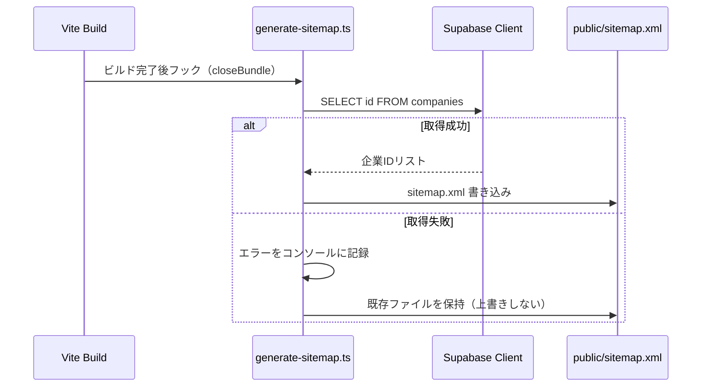
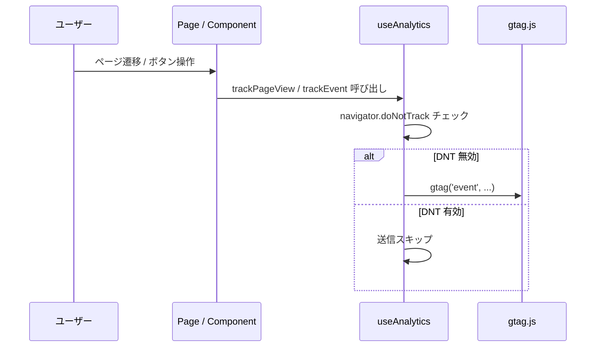
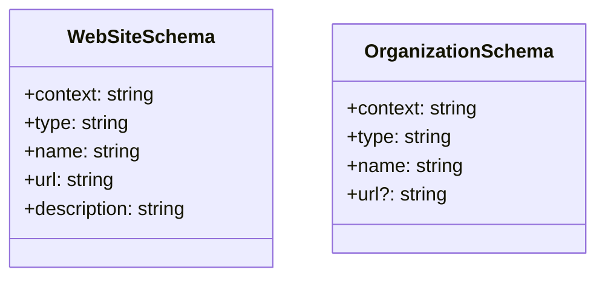

# 技術設計書: seo-ad-monetization

---

## 概要

「エンジニア幸福度マップ」は、エンジニアの働きやすさを可視化するWebサービスであり、現在Phase 1としてモックデータ実装が完了している。本機能は、検索エンジンからの自然流入増加、Google AdSenseによる収益化、SNSシェアによるトラフィック拡大、およびGA4を用いた計測を実現するための、SEO・広告・アナリティクス統合基盤を提供する。

本設計は既存のReact+Vite+TypeScript+Tailwind CSS構成を保持しつつ、新規コンポーネント・ユーティリティ・ビルドスクリプトを追加する拡張型アーキテクチャを採用する。CSR SPAの制約を踏まえ、OGP画像は静的共通画像1枚で対応し、SSR/SSGへの移行は将来フェーズに委ねる。

**ユーザー:** エンジニアユーザー（検索・SNS経由の訪問者）、サービス運営者（収益・分析データの受益者）が対象。本設計の変更により、各ページのSEO可視性・広告収益・回遊率が改善される。

### ゴール

- 全ページへのcanonical・完全OGP・構造化データ（JSON-LD）の付与
- Google AdSense広告ユニットのコンテンツ連動配置（インフィード・ディスプレイ）
- GA4によるページビュー・カスタムイベント計測（DNT準拠）
- SNSシェアボタン・URLコピー機能によるトラフィック拡大
- パンくずリスト・関連企業セクション・バーチャートクリック遷移による回遊性向上
- `sitemap.xml` のビルド時自動生成によるクローラビリティ確保

### 非ゴール

- SSR/SSG化（vite-plugin-ssg等）による動的OGP画像生成（Phase 2以降に検討）
- 指標フィルタリング専用ページ（`/filter/:metric`）の新規作成（既存フィルターバーへのアンカーリンクで代替）
- Supabase DBスキーマへの `website` フィールドのマイグレーション（任意フィールドとして型定義のみ追加）
- GDPR Cookie Consent バナーの実装（プライバシーポリシーページへのリンクで対応）

---

## アーキテクチャ

### 既存アーキテクチャの制約と活用点

- `react-helmet-async` v3 が `HelmetProvider` を `App.tsx` でラップ済み → 全ページでの `<Helmet>` 利用が即時可能
- AdSense publisher ID `ca-pub-3444579012936819` が `index.html` に `async` スクリプトとして実装済み → 広告ユニットコンポーネントの追加のみで完結
- `Company.id`（URLスラッグ形式）が `useParams` で取得可能 → canonical URL・OGP URL生成の素材として活用
- `vite.config.ts` に `manualChunks` 設定済み → `sitemap生成プラグイン` の追加が容易

### アーキテクチャパターン・境界マップ

フェーズ分割実装戦略を採用し、リスクの低い基盤から順次追加する。

```mermaid
graph TB
    subgraph Phase1 [Phase 1: SEO基盤]
        SeoUtils[src/utils/seo.ts]
        JsonLd[src/components/seo/JsonLd.tsx]
        Breadcrumb[src/components/navigation/Breadcrumb.tsx]
        SitemapScript[scripts/generate-sitemap.ts]
        RobotsTxt[public/robots.txt]
        OgImage[public/og-default.png]
    end

    subgraph Phase2 [Phase 2: 広告・アナリティクス]
        AdUnit[src/components/ads/AdUnit.tsx]
        UseAnalytics[src/hooks/useAnalytics.ts]
        PrivacyPage[src/pages/PrivacyPolicy.tsx]
    end

    subgraph Phase3 [Phase 3: エンゲージメント]
        ShareButtons[src/components/share/ShareButtons.tsx]
        CopyUrlButton[src/components/share/CopyUrlButton.tsx]
        UseClipboard[src/hooks/useClipboard.ts]
        RelatedCompanies[src/components/company/RelatedCompanies.tsx]
    end

    subgraph Modified [既存コンポーネント改修]
        AppTsx[src/App.tsx]
        HomeTsx[src/pages/Home.tsx]
        CompanyDetailTsx[src/pages/CompanyDetail.tsx]
        BarChart[src/components/charts/ComparisonBarChart.tsx]
        Footer[src/components/layout/Footer.tsx]
    end

    SeoUtils --> JsonLd
    SeoUtils --> HomeTsx
    SeoUtils --> CompanyDetailTsx
    JsonLd --> HomeTsx
    JsonLd --> CompanyDetailTsx
    Breadcrumb --> CompanyDetailTsx
    AdUnit --> HomeTsx
    AdUnit --> CompanyDetailTsx
    UseAnalytics --> HomeTsx
    UseAnalytics --> CompanyDetailTsx
    UseAnalytics --> ShareButtons
    ShareButtons --> CompanyDetailTsx
    CopyUrlButton --> UseClipboard
    CopyUrlButton --> CompanyDetailTsx
    RelatedCompanies --> CompanyDetailTsx
    AppTsx --> PrivacyPage
    Footer --> PrivacyPage
```



**アーキテクチャ統合の判断:**

- **OGP方式:** CSR SPAではSNSクローラーが動的metaを読み取れないため、`public/og-default.png`（1200×630px）の静的共通OGP画像1枚を全ページで使用する。企業固有のOGP画像生成はPhase 2以降で検討する（詳細は `research.md` 参照）。
- **sitemap.xml:** ビルド時スクリプト（`scripts/generate-sitemap.ts`）がSupabaseから企業IDを取得して静的生成する。生成失敗時は直前の有効なsitemapを保持するエラー処理を実装する。
- **ルートlazy loading:** `React.lazy` + `Suspense` をPhase 1で追加し、初期バンドルサイズを削減する。

### テクノロジースタック

| レイヤー | 選択 / バージョン | フィーチャーにおける役割 | 備考 |
|---|---|---|---|
| フロントエンド | React 18 + TypeScript（既存） | 全コンポーネント | 変更なし |
| メタ管理 | react-helmet-async v3（既存） | title・meta・canonical・JSON-LD | `<script type="application/ld+json">` 対応済み |
| アナリティクス | GA4 gtag.js（新規追加） | ページビュー・カスタムイベント | index.htmlにasync追加 |
| 広告 | Google AdSense（index.htmlスクリプト既存） | 広告ユニット配信 | AdUnitコンポーネントのみ新規 |
| ビルドツール | Vite（既存） | sitemap生成スクリプト統合 | vite.config.tsにプラグイン追加 |
| データ層 | Supabase（既存） | sitemap生成時の企業IDリスト取得 | ビルド時のみ使用 |

---

## システムフロー

### sitemap.xml ビルド時生成フロー



### GA4 イベント送信フロー



---

## 要件トレーサビリティ

| 要件 | サマリー | コンポーネント | インターフェース | フロー |
|---|---|---|---|---|
| 1.1, 1.2, 1.3 | title / description 動的生成 | `Home.tsx`, `CompanyDetail.tsx` | `generatePageTitle()`, `generatePageDescription()` | — |
| 1.4 | canonical URL設定 | `Home.tsx`, `CompanyDetail.tsx` | `generateCanonicalUrl()` | — |
| 1.5 | robots.txt 提供 | `public/robots.txt` | — | — |
| 1.6, 1.7 | sitemap.xml 生成・エラー処理 | `scripts/generate-sitemap.ts` | `SitemapGeneratorResult` | sitemap生成フロー |
| 2.1 | WebSite JSON-LD | `JsonLd.tsx`, `Home.tsx` | `JsonLdProps`, `generateWebSiteSchema()` | — |
| 2.2 | Organization JSON-LD | `JsonLd.tsx`, `CompanyDetail.tsx` | `generateOrganizationSchema()` | — |
| 2.3 | JSON-LD の script タグ埋め込み | `JsonLd.tsx` | `JsonLdProps` | — |
| 2.4 | 必須フィールド欠落時スキップ | `JsonLd.tsx`, `src/utils/seo.ts` | `generateOrganizationSchema()` | — |
| 3.1, 3.2, 3.3, 3.4, 3.5 | OGP・Twitter Card | `Home.tsx`, `CompanyDetail.tsx` | `generateOgMeta()` | — |
| 4.2 | ルートlazy loading | `App.tsx` | — | — |
| 4.5 | ローディングスケルトン | `CompanyDetail.tsx` | — | — |
| 4.6 | 広告ブロック時グレースフルデグラデーション | `AdUnit.tsx` | `AdUnitProps` | — |
| 5.1, 5.2, 5.3, 5.4, 5.5, 5.6, 5.7 | AdSense広告ユニット | `AdUnit.tsx`, `Home.tsx`, `CompanyDetail.tsx` | `AdUnitProps` | — |
| 6.1, 6.2, 6.4, 6.5 | SNSシェア・URLコピー | `ShareButtons.tsx`, `CopyUrlButton.tsx`, `useClipboard.ts` | `ShareButtonsProps`, `CopyUrlButtonProps`, `UseClipboardReturn` | — |
| 6.3 | TOP3ハイライト | `Home.tsx` | — | — |
| 7.1 | 関連企業セクション | `RelatedCompanies.tsx` | `RelatedCompaniesProps` | — |
| 7.2 | バーチャートクリック遷移 | `ComparisonBarChart.tsx` | `ComparisonBarChartProps` | — |
| 7.3 | パンくずリスト | `Breadcrumb.tsx` | `BreadcrumbProps` | — |
| 7.4 | フッター関連リンク | `Footer.tsx` | — | — |
| 7.5 | フィルタリングリンク（アンカー代替） | `CompanyDetail.tsx` | — | — |
| 8.1〜8.6 | GA4アナリティクス | `useAnalytics.ts`, `index.html` | `UseAnalyticsReturn`, `TrackEventParams` | GA4イベント送信フロー |
| 8.7 | プライバシーポリシーページ | `PrivacyPolicy.tsx` | — | — |
| 9.1 | viewport メタタグ | `index.html`（実装済み） | — | — |
| 9.3, 9.4, 9.5 | モバイルUI対応 | `AdUnit.tsx`, `ShareButtons.tsx` | — | — |

---

## コンポーネントとインターフェース

### コンポーネントサマリー

| コンポーネント | ドメイン/レイヤー | 役割 | 要件カバレッジ | P0/P1依存 | コントラクト |
|---|---|---|---|---|---|
| `src/utils/seo.ts` | ユーティリティ | SEO関連テキスト・URL・JSON-LD生成 | 1.1〜1.4, 2.1〜2.4, 3.1〜3.5 | — | Service |
| `JsonLd.tsx` | SEO / UI | JSON-LDスクリプトタグ注入 | 2.1〜2.4 | `seo.ts` (P0) | Service |
| `AdUnit.tsx` | 広告 / UI | AdSense広告ユニットラッパー | 5.1〜5.7 | AdSense script (P0) | Service |
| `ShareButtons.tsx` | シェア / UI | X・Facebookシェアボタン | 6.1, 6.2, 8.4 | `seo.ts` (P1), `useAnalytics.ts` (P1) | Service |
| `CopyUrlButton.tsx` | シェア / UI | URLコピーボタン + トースト通知 | 6.4, 6.5 | `useClipboard.ts` (P0) | Service |
| `Breadcrumb.tsx` | ナビゲーション / UI | パンくずリスト表示 | 7.3 | — | Service |
| `RelatedCompanies.tsx` | 企業 / UI | スコア近接企業3〜5件の内部リンク | 7.1 | `useCompanyData.ts` (P0) | Service |
| `useAnalytics.ts` | アナリティクス / Hook | GA4イベント送信・DNT制御 | 8.1〜8.6 | `gtag.js` (P0) | Service |
| `useClipboard.ts` | シェア / Hook | クリップボードコピー状態管理 | 6.4, 6.5 | Clipboard API (P0) | Service |
| `scripts/generate-sitemap.ts` | ビルド / スクリプト | sitemap.xml ビルド時生成 | 1.6, 1.7 | Supabase (P0) | Batch |
| `App.tsx`（改修） | ルーティング | lazy loading・/privacy-policy ルート追加 | 4.2, 8.7 | — | — |
| `Home.tsx`（改修） | ページ | canonical・OGP・JSON-LD・AdUnit・TOP3 | 1.1〜1.4, 2.1, 3.1〜3.5, 5.2, 6.3 | `seo.ts` (P0) | — |
| `CompanyDetail.tsx`（改修） | ページ | canonical・OGP・JSON-LD・シェア・パンくず・関連企業・AdUnit | 全要件 | `seo.ts` (P0) | — |
| `ComparisonBarChart.tsx`（改修） | チャート / UI | バークリック遷移追加 | 7.2 | React Router (P0) | — |
| `Footer.tsx`（改修） | レイアウト / UI | プライバシーポリシーリンク追加 | 7.4, 8.7 | — | — |

---

### SEOユーティリティ層

#### `src/utils/seo.ts`

| フィールド | 詳細 |
|---|---|
| 役割 | canonical URL生成・OGPテキスト生成・JSON-LD生成の純粋関数群 |
| 要件 | 1.1, 1.2, 1.3, 1.4, 2.1, 2.2, 2.4, 3.1, 3.2, 3.5 |

**責務と制約:**
- サイドエフェクトを持たない純粋関数のみで構成する
- `BASE_URL` 定数（`https://engineer-happiness-map.com`）を内部で保持する
- Organization スキーマ生成時、`website` フィールドが `undefined` の場合は `url` プロパティを省略し、必須フィールド欠落時は `null` を返す

**コントラクト:** Service [x]

##### Service Interface

```typescript
/** サイトのベースURL定数 */
export const BASE_URL = 'https://engineer-happiness-map.com'

/** canonical URL生成 */
export function generateCanonicalUrl(path: string): string

/** ページタイトル生成（最大60文字） */
export function generatePageTitle(
  companyName?: string,
  score?: number
): string

/** メタディスクリプション生成（最大160文字） */
export function generatePageDescription(
  company?: Pick<Company, 'name' | 'happinessScore' | 'industry' | 'location'>
): string

/** OGメタタグ情報 */
export interface OgMeta {
  title: string
  description: string
  url: string
  image: string
  type: 'website'
}

/** OGP情報生成 */
export function generateOgMeta(
  path: string,
  company?: Pick<Company, 'name' | 'happinessScore'>
): OgMeta

/** WebSite JSON-LDスキーマ */
export interface WebSiteSchema {
  '@context': 'https://schema.org'
  '@type': 'WebSite'
  name: string
  url: string
  description: string
}

/** Organization JSON-LDスキーマ */
export interface OrganizationSchema {
  '@context': 'https://schema.org'
  '@type': 'Organization'
  name: string
  url?: string
}

/** WebSite JSON-LD生成 */
export function generateWebSiteSchema(): WebSiteSchema

/**
 * Organization JSON-LD生成
 * @returns スキーマオブジェクト。必須フィールド(name)欠落時は null を返す
 */
export function generateOrganizationSchema(
  company: Pick<Company, 'name' | 'website'>
): OrganizationSchema | null

/** SNSシェアテキスト生成 */
export function generateShareText(
  companyName: string,
  score: number
): string

/** X（Twitter）シェアURL生成 */
export function generateTwitterShareUrl(text: string, url: string): string

/** Facebookシェアテキスト生成 */
export function generateFacebookShareUrl(url: string): string
```

- 事前条件: `path` は `/` から始まる文字列
- 事後条件: `generatePageTitle` は必ず60文字以内の文字列を返す。`generatePageDescription` は必ず160文字以内の文字列を返す
- 不変条件: `BASE_URL` は変更不可

**実装ノート:**
- `generatePageTitle` と `generatePageDescription` は文字列を末尾から切り詰め（`slice(0, N)`）で60/160文字制約を強制する
- テキスト切り詰め時の可読性確保のため、文節境界での切り詰めが望ましい

---

### SEOコンポーネント層

#### `src/components/seo/JsonLd.tsx`

| フィールド | 詳細 |
|---|---|
| 役割 | JSON-LDオブジェクトをHelmet経由で `<script type="application/ld+json">` として注入 |
| 要件 | 2.1, 2.2, 2.3, 2.4 |

**責務と制約:**
- `schema` が `null` の場合はnullを返してレンダリングをスキップする（2.4）
- `JSON.stringify` によるオブジェクトシリアライズのみを担当する

**コントラクト:** Service [x]

##### Service Interface

```typescript
export interface JsonLdProps {
  schema: WebSiteSchema | OrganizationSchema | null
}

export default function JsonLd({ schema }: JsonLdProps): React.ReactElement | null
```

**実装ノート:**
- `react-helmet-async` の `<Helmet>` に `script={[{ type: 'application/ld+json', innerHTML: JSON.stringify(schema) }]}` 形式で渡す
- リスク: `JSON.stringify` の循環参照に注意。スキーマオブジェクトは純粋なPOJOのみ受け付ける

---

### 広告コンポーネント層

#### `src/components/ads/AdUnit.tsx`

| フィールド | 詳細 |
|---|---|
| 役割 | Google AdSenseの広告ユニット（インフィード・ディスプレイ）をラップする再利用可能コンポーネント |
| 要件 | 5.1, 5.2, 5.3, 5.4, 5.5, 5.6, 5.7 |

**責務と制約:**
- `window.adsbygoogle` が未定義の場合（広告ブロッカー）でもレイアウト崩れが発生しないよう、`minHeight` を `containerStyle` で保証する（5.5）
- `useEffect` 内で `(window.adsbygoogle = window.adsbygoogle || []).push({})` を呼び出す（5.6）
- 「広告」ラベルを上部に表示し、コンテンツと広告の境界を明示する（5.7）
- モバイルでのレスポンシブ広告は `data-full-width-responsive="true"` で対応する（5.4）

**依存:**
- Outbound: `window.adsbygoogle`（Google AdSense） — 広告描画 (P0)

**コントラクト:** Service [x]

##### Service Interface

```typescript
export type AdFormat = 'auto' | 'fluid' | 'rectangle'
export type AdLayout = 'in-article' | 'in-feed' | undefined

export interface AdUnitProps {
  /** AdSense広告スロットID */
  adSlot: string
  /** 広告フォーマット（デフォルト: 'auto'） */
  adFormat?: AdFormat
  /** 広告レイアウト（in-feed広告等で使用） */
  adLayout?: AdLayout
  /** コンテナのTailwindクラス */
  className?: string
  /** 広告ブロック時の最小高さ(px)（デフォルト: 100） */
  minHeight?: number
}

export default function AdUnit(props: AdUnitProps): React.ReactElement
```

**実装ノート:**
- `adsbygoogle` の型定義が存在しないため、`window` インターフェース拡張が必要（`declare global { interface Window { adsbygoogle: unknown[] } }`）
- `data-adtest="on"` は開発環境でのみ有効化する（`import.meta.env.DEV` で制御）
- リスク: AdSenseがlocalhost/開発環境でテスト広告を配信しないため、本番環境での動作確認が必要

---

### シェアコンポーネント層

#### `src/components/share/ShareButtons.tsx`

| フィールド | 詳細 |
|---|---|
| 役割 | X（旧Twitter）・Facebookのシェアボタンを提供し、クリック時にGA4イベントを送信する |
| 要件 | 6.1, 6.2, 8.4 |

**コントラクト:** Service [x]

##### Service Interface

```typescript
export interface ShareButtonsProps {
  /** シェア対象の企業名 */
  companyName: string
  /** 企業の幸福度スコア */
  score: number
  /** シェアするページのパス（例: /company/mercari-jp） */
  pagePath: string
}

export default function ShareButtons(props: ShareButtonsProps): React.ReactElement
```

**実装ノート:**
- シェアURLは `seo.ts` の `generateTwitterShareUrl` / `generateFacebookShareUrl` を使用する
- クリック時に `useAnalytics` の `trackEvent({ name: 'share', platform: 'twitter' | 'facebook' })` を呼び出す
- タッチターゲットは最低44×44pxを確保する（9.3）

---

#### `src/components/share/CopyUrlButton.tsx`

| フィールド | 詳細 |
|---|---|
| 役割 | 現在のページURLをクリップボードにコピーし、成功時にトースト通知を表示する |
| 要件 | 6.4, 6.5 |

**コントラクト:** Service [x]

##### Service Interface

```typescript
export interface CopyUrlButtonProps {
  /** コピーするURL（未指定時はwindow.location.hrefを使用） */
  url?: string
  /** ボタンのTailwindクラス追加 */
  className?: string
}

export default function CopyUrlButton(props: CopyUrlButtonProps): React.ReactElement
```

**実装ノート:**
- `useClipboard` フックからコピー状態（`isCopied`）を取得し、コピー済みの場合はボタンラベルを「コピー済み ✓」に変更する
- トースト通知はインラインのフェードインアニメーション（Tailwind `transition-opacity`）で実装し、外部ライブラリは使用しない

---

### ナビゲーションコンポーネント層

#### `src/components/navigation/Breadcrumb.tsx`

| フィールド | 詳細 |
|---|---|
| 役割 | 階層ナビゲーション（パンくずリスト）を表示し、SEOのBreadcrumbList構造化データを提供する |
| 要件 | 7.3 |

**コントラクト:** Service [x]

##### Service Interface

```typescript
export interface BreadcrumbItem {
  /** 表示ラベル */
  label: string
  /** リンク先パス（最末端はundefined） */
  href?: string
}

export interface BreadcrumbProps {
  items: BreadcrumbItem[]
}

export default function Breadcrumb(props: BreadcrumbProps): React.ReactElement
```

**実装ノート:**
- `<nav aria-label="パンくずリスト">` + `<ol>` 要素でマークアップする（アクセシビリティ）
- 最末端のアイテムは `<span aria-current="page">` とし、リンクなしにする
- Tailwind: `flex items-center gap-1 text-sm text-gray-500`

---

### 企業コンポーネント層

#### `src/components/company/RelatedCompanies.tsx`

| フィールド | 詳細 |
|---|---|
| 役割 | 幸福度スコアが近い企業3〜5件を「他の企業も見る」セクションとして表示し、内部リンクを提供する |
| 要件 | 7.1 |

**依存:**
- Inbound: `CompanyDetail.tsx` — 基準企業データの提供 (P0)
- Outbound: `useCompanyData.ts` — 企業一覧データの取得 (P0)
- Outbound: React Router `Link` — 詳細ページへの遷移 (P0)

**コントラクト:** Service [x]

##### Service Interface

```typescript
export interface RelatedCompaniesProps {
  /** 基準となる現在表示中の企業 */
  currentCompany: Company
  /** 表示する関連企業の最大数（デフォルト: 4） */
  maxCount?: number
}

export default function RelatedCompanies(props: RelatedCompaniesProps): React.ReactElement | null
```

**関連企業の選択アルゴリズム:**
1. 全企業リストから `currentCompany.id` を除外する
2. 各企業との `happinessScore` の差の絶対値で昇順ソートする
3. 上位 `maxCount` 件を返す

**実装ノート:**
- リスク: 企業数が少ない場合（4件未満）、`maxCount` より少ない件数を返す。その場合はセクション自体を非表示にする（`null` を返す）

---

### アナリティクスフック層

#### `src/hooks/useAnalytics.ts`

| フィールド | 詳細 |
|---|---|
| 役割 | GA4イベント送信をラップし、DNT対応・型安全なイベント計測インターフェースを提供する |
| 要件 | 8.1, 8.2, 8.3, 8.4, 8.5, 8.6 |

**依存:**
- Outbound: `window.gtag`（GA4 gtag.js） — イベント送信 (P0)
- Outbound: `navigator.doNotTrack` — DNT設定の検出 (P0)

**コントラクト:** Service [x]

##### Service Interface

```typescript
/** GA4に送信するイベント種別 */
export type AnalyticsEventName =
  | 'page_view'
  | 'company_view'
  | 'share'
  | 'copy_url'

/** page_view イベントのパラメータ */
export interface PageViewParams {
  page_path: string
  page_title: string
}

/** company_view イベントのパラメータ */
export interface CompanyViewParams {
  company_name: string
  happiness_score: number
}

/** share イベントのパラメータ */
export interface ShareEventParams {
  platform: 'twitter' | 'facebook'
  company_name: string
  item_id: string
}

/** copy_url イベントのパラメータ */
export interface CopyUrlEventParams {
  item_id: string
}

/** イベント種別とパラメータのマッピング */
export type TrackEventParams =
  | { name: 'page_view'; params: PageViewParams }
  | { name: 'company_view'; params: CompanyViewParams }
  | { name: 'share'; params: ShareEventParams }
  | { name: 'copy_url'; params: CopyUrlEventParams }

export interface UseAnalyticsReturn {
  /** ページビュー送信（React Router useLocationと組み合わせて使用） */
  trackPageView: (params: PageViewParams) => void
  /** カスタムイベント送信 */
  trackEvent: (event: TrackEventParams) => void
  /** DNT有効フラグ */
  isDntEnabled: boolean
}

export function useAnalytics(): UseAnalyticsReturn
```

- 事前条件: `window.gtag` が定義されていること（`index.html` でのgtag.jsロードが前提）
- 事後条件: `isDntEnabled === true` の場合、`trackPageView` と `trackEvent` は何もしない
- DNT検出: `navigator.doNotTrack === '1'` の場合にトラッキングを無効化する

**実装ノート:**
- `window.gtag` の型定義拡張: `declare global { interface Window { gtag: (...args: unknown[]) => void } }`
- リスク: gtag.jsの非同期ロード完了前にイベントが発火する可能性がある。`window.gtag` の存在チェックを各送信前に行う

---

#### `src/hooks/useClipboard.ts`

| フィールド | 詳細 |
|---|---|
| 役割 | Clipboard APIを使用したURLコピーと、コピー成功状態の一時表示を管理する |
| 要件 | 6.4, 6.5 |

**コントラクト:** Service [x]

##### Service Interface

```typescript
export interface UseClipboardReturn {
  /** クリップボードにテキストをコピーする */
  copy: (text: string) => Promise<void>
  /** コピー成功後の一時フラグ（指定ミリ秒後に自動リセット） */
  isCopied: boolean
}

/**
 * @param resetDelay コピー成功フラグのリセット遅延（ミリ秒、デフォルト: 2000）
 */
export function useClipboard(resetDelay?: number): UseClipboardReturn
```

**実装ノート:**
- `navigator.clipboard.writeText` を使用する（モダンブラウザ標準）
- エラー時（権限拒否等）は `console.error` でログ出力し、`isCopied` は更新しない

---

### ビルドスクリプト層

#### `scripts/generate-sitemap.ts`

| フィールド | 詳細 |
|---|---|
| 役割 | Viteビルド完了後にSupabaseから企業IDを取得し、`public/sitemap.xml` を生成するビルド時スクリプト |
| 要件 | 1.6, 1.7 |

**依存:**
- Outbound: `@supabase/supabase-js`（Supabase Client） — 企業IDリスト取得 (P0)
- Outbound: Node.js `fs`モジュール — ファイル書き込み (P0)

**コントラクト:** Batch [x]

##### Batch Contract

```typescript
export interface SitemapUrl {
  loc: string
  changefreq: 'daily' | 'weekly' | 'monthly'
  priority: number
}

export interface SitemapGeneratorResult {
  success: boolean
  urlCount: number
  outputPath: string
  error?: string
}

/** sitemap.xml 生成エントリポイント */
export async function generateSitemap(): Promise<SitemapGeneratorResult>
```

- トリガー: `vite.config.ts` の `closeBundle` フック（ビルド完了後）
- 入力: Supabase `companies` テーブルの `id` カラム
- 出力: `public/sitemap.xml`（XML Sitemap Protocol 0.9形式）
- べき等性: 既存ファイルを上書きする。失敗時は既存ファイルを保持する（1.7）

**sitemap.xml の構成:**

| URL | changefreq | priority |
|---|---|---|
| `{BASE_URL}/` | daily | 1.0 |
| `{BASE_URL}/company/{id}` | weekly | 0.8 |

**実装ノート:**
- 環境変数 `VITE_SUPABASE_URL` と `VITE_SUPABASE_ANON_KEY` をビルド時に読み込む（`dotenv` または Viteの `loadEnv` を使用）
- エラー時はプロセスを終了させず（`process.exit` 不使用）、コンソールにエラーを出力して既存ファイルを保持する（1.7）

---

### 既存コンポーネント改修

#### `src/App.tsx`（改修）

- `React.lazy` + `Suspense` を使用してルートコンポーネントをlazy loadingに変更する（4.2）
- `/privacy-policy` ルートを追加し、`PrivacyPolicy` ページをlazy importする（8.7）
- `Suspense` の `fallback` には全画面スピナーを設定する

```typescript
// 改修後のimportパターン
const Home = React.lazy(() => import('./pages/Home'))
const CompanyDetail = React.lazy(() => import('./pages/CompanyDetail'))
const PrivacyPolicy = React.lazy(() => import('./pages/PrivacyPolicy'))
```

#### `src/pages/Home.tsx`（改修）

- `<Helmet>` に以下を追加する:
  - `<link rel="canonical" href={generateCanonicalUrl('/')} />`
  - `og:url`, `og:image`（`/og-default.png`）, `twitter:card` 等の完全OGPタグ
- `<JsonLd schema={generateWebSiteSchema()} />` をHelmet内に配置する
- `<AdUnit adSlot="SLOT_ID_HOME_INFEED" adFormat="fluid" adLayout="in-feed" />` を CompanyCardリストの5〜6件ごとに挿入する
- TOP3ハイライト: `happinessScore` 降順でソートした上位3件に `ring-2 ring-green-400` 等の強調スタイルを適用する（6.3）

#### `src/pages/CompanyDetail.tsx`（改修）

- `<Helmet>` に canonical・完全OGP・Twitter Cardタグを追加する
- `<JsonLd schema={generateOrganizationSchema(company)} />` を追加する
- `<Breadcrumb>` をメインコンテンツ最上部に配置する
- `<ShareButtons>` と `<CopyUrlButton>` をHeroセクション内に配置する
- `<AdUnit adSlot="SLOT_ID_DETAIL_DISPLAY" />` をスコア詳細セクション後に配置する
- `<RelatedCompanies currentCompany={company} />` をページ末尾に配置する
- `useAnalytics` フックを使用し、company_viewイベントをマウント時に送信する
- ローディング時のスピナーをスケルトンUIに変更する（4.5）

#### `src/components/charts/ComparisonBarChart.tsx`（改修）

```typescript
// 追加するprops
export interface ComparisonBarChartProps {
  /** バークリック時に呼ばれるコールバック（企業IDを渡す） */
  onBarClick?: (companyId: string) => void
}
```

- Rechartsの `<Bar>` に `onClick` ハンドラを追加し、`onBarClick(companyId)` を呼び出す（7.2）
- `Home.tsx` 側で `useNavigate` を使用して `/company/:id` に遷移する

#### `src/components/layout/Footer.tsx`（改修）

- プライバシーポリシーへの `<Link to="/privacy-policy">` を追加する（7.4, 8.7）
- 関連コンテンツリンク（トップページへ戻る等）を追加する

---

### 新規ページ

#### `src/pages/PrivacyPolicy.tsx`

| フィールド | 詳細 |
|---|---|
| 役割 | GA4とGoogle AdSenseの利用に基づくプライバシーポリシーを表示する静的ページ |
| 要件 | 8.7 |

- `<Helmet>` で適切な `<title>` と `<meta name="description">` を設定する
- canonical URLを設定する
- 記載事項: 収集するデータの種類（アクセスログ・Cookie）、利用目的（分析・広告配信）、第三者提供（Google）、オプトアウト方法、お問い合わせ先
- 静的コンテンツのみで構成し、外部データ取得は行わない

---

### 静的ファイル・ビルド設定

#### `public/robots.txt`

```
User-agent: *
Allow: /
Disallow: /api/

Sitemap: https://engineer-happiness-map.com/sitemap.xml
```

#### `index.html` 変更

以下を `<head>` に追加する:

1. **GA4スクリプト**: `<script async src="https://www.googletagmanager.com/gtag/js?id=G-XXXXXXXXXX"></script>` および初期化スクリプト（GA4計測IDは環境変数から注入）
2. **Twitter Card メタタグ（デフォルト値）**: `twitter:card`, `twitter:site`, `twitter:title`, `twitter:description`, `twitter:image`
3. **OGPの完全版**: `og:url`（ルートURL）、`og:image`（`/og-default.png`の絶対URL）

**注:** ページ固有のmetaはHelmetで上書きされるため、`index.html` の値はフォールバック（デフォルト）として機能する。

#### `public/og-default.png`

- サイズ: 1200×630px
- 内容: サービスロゴ・サービス名「エンジニア幸福度マップ」・キャッチコピーを含むデザイン画像
- フォーマット: PNG（WebP変換はPhase 2）
- 配置: `public/og-default.png`（Viteビルド時に `dist/og-default.png` に出力）

#### `vite.config.ts` 変更

```typescript
// Viteプラグインとしてsitemap生成を統合
import { generateSitemap } from './scripts/generate-sitemap'

export default defineConfig({
  plugins: [
    react(),
    {
      name: 'generate-sitemap',
      closeBundle: async () => {
        await generateSitemap()
      },
    },
  ],
  // ... 既存設定
})
```

---

## データモデル

### `src/types/company.ts` 型拡張

`Company` インターフェースに任意フィールドを追加する。

```typescript
export interface Company {
  // ... 既存フィールド
  /** 企業の公式Webサイト URL（Organization JSON-LD の url プロパティに使用） */
  website?: string
}
```

**制約:**
- `website` は任意フィールドのため、既存コンポーネントへの影響なし
- Supabase DBスキーマへのマイグレーションは本フェーズのスコープ外。DBにカラムが存在しない場合は `undefined` になる

### JSON-LDスキーマ定義（`src/utils/seo.ts` 内）



---

## エラーハンドリング

### エラー戦略

グレースフルデグラデーション（部分的な機能提供）を優先する。外部スクリプト（AdSense・GA4）の失敗はコアコンテンツ表示に影響させない。

### エラーカテゴリと対応

| カテゴリ | 発生箇所 | 対応 |
|---|---|---|
| 広告ブロック（AdUnit） | `AdUnit.tsx` | `window.adsbygoogle` 未定義チェック、`minHeight` でレイアウト保護（5.5） |
| Clipboard API拒否 | `useClipboard.ts` | `console.error` でログ、`isCopied` を更新しない |
| GA4スクリプト未ロード | `useAnalytics.ts` | `window.gtag` 存在チェック、存在しなければ送信スキップ |
| JSON-LD必須フィールド欠落 | `seo.ts` | `generateOrganizationSchema` が `null` を返す。`JsonLd` が `null` を受けてスキップ（2.4） |
| sitemap生成失敗 | `generate-sitemap.ts` | エラーをコンソールに記録し、既存 `sitemap.xml` を保持（1.7） |
| Supabase接続エラー（sitemap） | `generate-sitemap.ts` | try/catch でキャッチし、`SitemapGeneratorResult.success = false` で返却 |

### モニタリング

- GA4カスタムイベントにより、シェアクリック・企業閲覧の行動データを収集する
- sitemap生成エラーはビルドログに記録されるため、CIのビルドログ監視で検出可能

---

## テスト戦略

### ユニットテスト

- `src/utils/seo.ts`: `generatePageTitle`（60文字制約）、`generatePageDescription`（160文字制約）、`generateOrganizationSchema`（`null` 返却ケース）
- `useClipboard.ts`: Clipboard API モック、`isCopied` の状態遷移とリセット
- `useAnalytics.ts`: DNT有効時に `gtag` が呼ばれないことの確認
- `scripts/generate-sitemap.ts`: Supabase取得失敗時の既存ファイル保持動作

### インテグレーションテスト

- `CompanyDetail.tsx` + `JsonLd.tsx`: Helmetが `<script type="application/ld+json">` を出力することの確認
- `ShareButtons.tsx` + `useAnalytics.ts`: シェアクリック時にGA4イベントが送信されることの確認
- `AdUnit.tsx`: `window.adsbygoogle` が未定義の状態でもDOMが正常描画されることの確認

### E2Eテスト

- トップページ → 企業詳細ページ: パンくずリストが正しく表示されること
- 企業詳細ページ: URLコピーボタン → トースト通知が表示されること
- ランキングチャートのバークリック → 企業詳細ページへの遷移

### パフォーマンステスト

- Lighthouse: モバイルPerformanceスコア ≥ 70（4.1）
- CLS < 0.1（4.5）
- lazy loading導入後のLCP改善確認

---

## セキュリティ考慮事項

- `generateOrganizationSchema` の `url` フィールドには `company.website` の値をそのまま使用する。URLバリデーション（`URL` コンストラクタによるパース検証）を実施し、不正なURLはスキップする
- `JSON.stringify` によるJSON-LD出力時にXSSが発生しないよう、スキーマオブジェクトはユーザー入力を直接含まないPOJOのみを渡す
- プライバシーポリシーはGA4・AdSenseのデータ収集を明示し、利用者の同意取得の根拠として機能する

---

## パフォーマンスと拡張性

- **lazy loading（4.2）:** `React.lazy` + `Suspense` によるルートベースのコード分割で、初期バンドルから `CompanyDetail.tsx` と `PrivacyPolicy.tsx` を分離する
- **AdSenseスクリプト（5.6）:** `index.html` の `async` 属性により、メインスレッドのブロッキングを防止する（実装済み）
- **GA4スクリプト（8.5）:** `async` 属性付きの `<script>` タグで非同期ロードする
- **sitemap更新:** 企業データが動的に追加される場合、ビルドの再実行が必要。CI/CD パイプラインでの定期的なビルドを推奨する

---

## 参考資料

調査の詳細・技術選定の根拠は `research.md` を参照すること。
