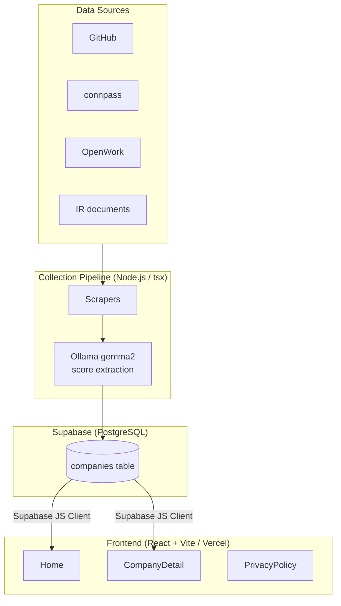

# Developer Satisfaction Map

[日本語 README](README.md)

Developer Satisfaction Map is an open-source web application that visualizes companies where software engineers may find a better working environment by combining public company information, community activity, reviews, and OSS activity.

**Live app:** https://dev-satisfaction-map.vercel.app/

[](LICENSE)

## Architecture



## Main features

- Company cards and satisfaction ranking
- Seven-axis radar chart for company comparison
- Personalized weighting of seven evaluation metrics
- Filtering by keyword, score threshold, remote-work rate, and technology tags
- Data-source badges and confidence indicators
- Related-company recommendations
- Share links and SEO metadata
- Multi-source data collection pipeline using GitHub, connpass, OpenWork, and IR documents

The dataset currently includes more than 70 Japanese technology companies.

## Scoring model

The overall satisfaction score normalizes seven metrics to a 0–100 scale and calculates a weighted total.

| Metric | Weight | Notes |
|---|---:|---|
| techStackModernity | 0.20 | Estimated from GitHub activity |
| remoteRate | 0.20 | Collected from available company/review data |
| estimatedOvertimeHours | 0.20 | Lower values score higher |
| turnoverRate | 0.10 | Lower values score higher |
| retentionRate | 0.10 | Higher values score higher |
| devEnvironment | 0.10 | Estimated from public engineering signals |
| skillUpSupport | 0.10 | Estimated from community activity |

A personalized score can be calculated by changing the importance of each metric. The project also exposes data-source and freshness information so users can judge how reliable a score is.

See [Scoring and data transparency](docs/scoring.md) for the formulas, data-source limitations, freshness, confidence, and missing-data behavior.

## Technology stack

### Frontend

- React 18
- TypeScript
- Vite
- React Router
- Recharts
- Tailwind CSS

### Backend / infrastructure

- Supabase / PostgreSQL
- Vercel

### Data pipeline

- Node.js + TypeScript (`tsx`)
- cheerio
- Ollama / gemma2

### Testing

- Vitest
- fast-check for property-based testing

## Local setup

```bash
npm install
npm run dev
npm run build
```

Create `.env.local` and configure your Supabase project:

```bash
VITE_SUPABASE_URL=https://xxxxxxxxxxxx.supabase.co
VITE_SUPABASE_ANON_KEY=eyJhbGci...
```

For the data pipeline:

```bash
cp pipeline.env.sample pipeline.env
npx tsx pipeline/run.ts --company mercari-jp --source github,connpass
```

External data sources may have their own terms of service, authentication requirements, and usage restrictions. Contributors are responsible for reviewing and respecting them.

## Contributing

Contributions are welcome, including bug fixes, new data sources, scoring improvements, documentation, accessibility, performance, and test coverage.

Please read [CONTRIBUTING.md](CONTRIBUTING.md) before starting a larger change. Opening an Issue first is recommended for changes that affect data collection or scoring behavior.

## Roadmap

The public roadmap is tracked with GitHub Issues:

- [#2 Add GitHub Actions CI for lint and build checks](https://github.com/swdevsmz/dev-satisfaction-map/issues/2)
- [#3 Document scoring methodology and data provenance](https://github.com/swdevsmz/dev-satisfaction-map/issues/3)
- [#4 Make data-source integrations easier to extend](https://github.com/swdevsmz/dev-satisfaction-map/issues/4)

## License

This project is licensed under the [MIT License](LICENSE).
