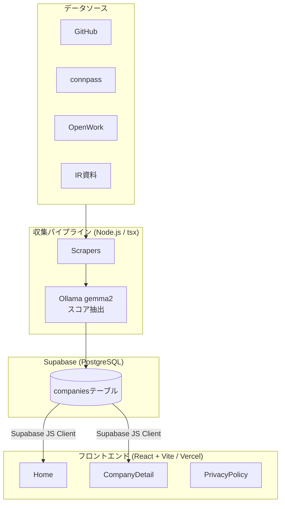

# エンジニア幸福度マップ

[English README](README.en.md)

求人データ・口コミ・OSSアクティビティから、エンジニアが働きやすい企業を可視化するWebサービスです。

**URL:** https://dev-satisfaction-map.vercel.app/

[](LICENSE)

---

## アーキテクチャ



---

## 主な機能

### フロントエンド

| 機能 | 説明 |
|------|------|
| 企業カード一覧 | 幸福度スコア順に企業をカード表示。クリックでレーダーチャートを更新 |
| 幸福度ランキング | 棒グラフで上位企業を比較。クリックで詳細ページへ遷移 |
| レーダーチャート | 選択企業の7指標バランスをレーダー表示（スクロール追従） |
| 企業詳細ページ | 各指標の進捗バー・数値・データソースバッジを表示 |
| **パーソナライズフィルタ** | 7指標ごとに重要度スライダー（0〜3段階）を設定し、自分軸のマッチ度順でランキングを並び替え。設定はlocalStorageに保存 |
| **企業フィルター** | キーワード・スコア閾値・リモート率・技術タグで企業を絞り込み |
| **データソースバッジ** | 各指標の隣に取得元ソース（GitHub・connpass・OpenWork・IR）を表示。未取得は点線表示 |
| **信頼度インジケーター** | データの鮮度とソース数から信頼スコア（0〜100）を算出し、詳細ページに進捗バーで表示 |
| **関連企業** | 詳細ページで幸福度スコアが近い企業を最大4社表示 |
| **シェア機能** | X（Twitter）・Facebookへのシェアボタン、URLコピーボタン |
| **広告** | Google AdSense インフィード広告（5件ごとに挿入） |
| **SEO対応** | react-helmet-async によるページごとの title / description / OGP / Twitter Card。JSON-LD構造化データ（WebSite・Organization）。canonical URL管理 |
| **プライバシーポリシー** | Google Analytics・AdSense の利用・オプトアウト方法を記載 |

### データ収集パイプライン

| ソース | 取得データ | 対応企業数 |
|--------|-----------|-----------|
| **GitHub** | OSSリポジトリ数・言語スタック・スター数 | 70社以上 |
| **connpass** | 勉強会開催頻度・参加者数（スキルアップ支援の推定値） | 80社以上 |
| **OpenWork** | 残業時間・定着率（社員口コミの実測値） | 8社 |
| **IR資料** | 採用・離職データ（公式開示情報） | 30社以上 |

- 4ソースを並行スクレイピング → Ollama (gemma2) でスコア抽出 → Supabase に保存
- OpenWorkはCookie認証に対応（`pipeline.env` に `OPENWORK_COOKIE` を設定）

### データ

- **登録企業数: 72社以上**（東京・関西のITテック企業）
- Nintendo・Capcom・楽天・サイバーエージェント・メルカリ・フリー等を含む

---

## スコア算出ロジック

幸福度スコアは7指標を 0–100 に正規化し、重み付き合計で算出します。

算出式、データソースの限界、鮮度・信頼度、欠損値の扱いは [スコア算出とデータの透明性](docs/scoring.md) を参照してください。

| 指標 | 重み | 備考 |
|------|------|------|
| techStackModernity (1–10) | 0.20 | GitHubから推定 |
| remoteRate (0–100%) | 0.20 | OpenWorkから取得 |
| estimatedOvertimeHours | 0.20 | 反転: 少ないほど高評価 |
| turnoverRate (0–100%) | 0.10 | 反転: 低いほど高評価 |
| retentionRate (0–100%) | 0.10 | |
| devEnvironment (1–10) | 0.10 | GitHubから推定 |
| skillUpSupport (1–10) | 0.10 | connpassから推定 |

スコア色分け: ≥70 → 緑、≥40 → 黄、<40 → 赤

**パーソナルスコア:** ユーザーが設定した重みで各指標を再重み付けして算出。全スライダーが0の場合は幸福度スコアにフォールバック。

---

## 技術スタック

**フロントエンド:**
- React 18 + TypeScript
- Vite
- React Router v6
- Recharts（レーダーチャート・棒グラフ）
- Tailwind CSS
- react-helmet-async

**バックエンド / インフラ:**
- Supabase (PostgreSQL + RLS)
- Vercel（ホスティング・自動デプロイ）

**パイプライン:**
- Node.js + TypeScript (`tsx`)
- cheerio（HTML解析）
- Ollama gemma2（スコア抽出LLM）

**テスト:**

- Vitest
- fast-check（プロパティベーステスト）

---

## セットアップ

### フロントエンド開発

```bash
npm install
npm run dev       # 開発サーバー起動 (http://localhost:5173)
npm run build     # TypeScript型チェック + Viteビルド
npm run lint      # ESLint実行
```

### 環境変数

`.env.local` を作成し、Supabase Dashboardの値を設定:

```bash
VITE_SUPABASE_URL=https://xxxxxxxxxxxx.supabase.co
VITE_SUPABASE_ANON_KEY=eyJhbGci...
```

### Supabase セットアップ

```bash
npx supabase login
npx supabase link --project-ref <project-ref>
npm run db:push   # マイグレーション適用
```

### データ収集パイプライン

```bash
cp pipeline.env.sample pipeline.env
# pipeline.env に SUPABASE_SERVICE_ROLE_KEY / OLLAMA_HOST 等を設定

# 単一企業・単一ソースの実行例
npx tsx pipeline/run.ts --company mercari-jp --source github,connpass

# OpenWork（Cookie必須・利用規約確認）
npx tsx pipeline/run.ts --company mercari-jp --source openwork --accept-tos
```

---

## Vercel デプロイ

1. GitHub リポジトリを Vercel でインポート（Framework: Vite）
2. 環境変数 `VITE_SUPABASE_URL` / `VITE_SUPABASE_ANON_KEY` を設定
3. `main` ブランチへのプッシュで自動デプロイ

SPAルーティングは `vercel.json` で `index.html` にリライト済み。

---

## ディレクトリ構成

```text
src/
  components/
    ads/
      AdUnit.tsx                   # Google AdSense 広告ユニット
    charts/
      RadarChartComponent.tsx      # レーダーチャート
      ComparisonBarChart.tsx       # ランキング棒グラフ
    company/
      CompanyCard.tsx              # 企業カード
      ScoreBadge.tsx               # スコアバッジ
      SourceBadge.tsx              # データソースバッジ（GitHub/connpass等）
      ReliabilityIndicator.tsx     # 信頼度インジケーター
      RelatedCompanies.tsx         # 関連企業リスト
    filter/
      PersonalWeightPanel.tsx      # パーソナライズフィルタUI
      CompanyFilterBar.tsx         # キーワード・タグ・スコアフィルター
    layout/
      Header.tsx
      Footer.tsx
    navigation/
      Breadcrumb.tsx               # パンくずナビゲーション
    seo/
      JsonLd.tsx                   # JSON-LD構造化データ注入
    share/
      ShareButtons.tsx             # X・Facebookシェアボタン
      CopyUrlButton.tsx            # クリップボードコピー
  constants/
    sourceMetricMap.ts             # ソース×指標の静的マッピング
  hooks/
    useCompanyData.ts              # 企業一覧フェッチ
    useCompanyById.ts              # 企業詳細 + raw_documents 並行フェッチ
    useCompanyFilter.ts            # フィルター状態管理
    usePersonalWeights.ts          # 重みスライダー状態 + localStorage
    useAnalytics.ts                # Google Analytics イベントトラッキング（DNT対応）
    useClipboard.ts                # クリップボードコピー
  lib/
    supabase.ts                    # Supabaseクライアント + rowToCompany
  pages/
    Home.tsx                       # 企業一覧・フィルタ・チャートパネル
    CompanyDetail.tsx              # 企業詳細・信頼度・ソースバッジ
    PrivacyPolicy.tsx              # プライバシーポリシー
  types/
    company.ts                     # Company / UserWeights / DataSource 型定義
  utils/
    scoring.ts                     # スコア算出・正規化・パーソナルスコア
    reliability.ts                 # 信頼度スコア・相対日付フォーマット
    seo.ts                         # canonical URL・OGP・JSON-LD生成ユーティリティ

pipeline/
  run.ts                           # パイプラインエントリポイント
  scrapers/
    github.ts                      # GitHub スクレイパー
    connpass.ts                    # connpass スクレイパー
    openwork.ts                    # OpenWork スクレイパー（Cookie認証）
    ir.ts                          # IR資料スクレイパー
  maintenance/
    fill-descriptions.ts           # description未設定企業の補完

supabase/
  migrations/                      # DBマイグレーション
```

---

## Contributing

バグ報告、データソース追加、スコアリング改善、ドキュメント改善などのコントリビューションを歓迎します。

大きな変更を始める前にIssueを作成し、方針を共有してください。セットアップ、品質チェック、PRルール、外部データ利用時の注意事項は [CONTRIBUTING.md](CONTRIBUTING.md) を参照してください。

---

## Roadmap

現在の主なロードマップはGitHub Issuesで管理しています。

- [#2 Add GitHub Actions CI for lint and build checks](https://github.com/swdevsmz/dev-satisfaction-map/issues/2)
- [#3 Document scoring methodology and data provenance](https://github.com/swdevsmz/dev-satisfaction-map/issues/3)
- [#4 Make data-source integrations easier to extend](https://github.com/swdevsmz/dev-satisfaction-map/issues/4)

完了した改善もIssue / Pull Requestとして履歴を残し、継続的にOSSとしてメンテナンスしていきます。

---

## License

This project is licensed under the [MIT License](LICENSE).
