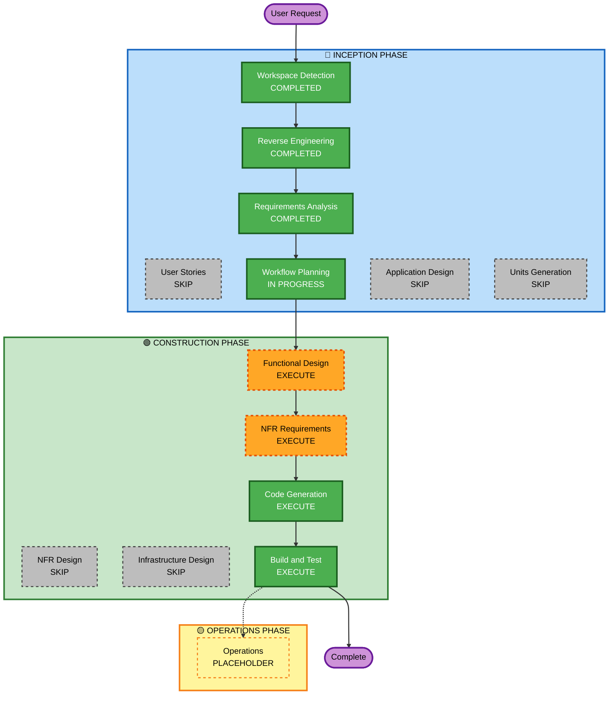

# Execution Plan - 企業絞り込み機能

## Detailed Analysis Summary

### Transformation Scope (Brownfield)
- **Transformation Type**: Single Feature Addition
- **Primary Changes**: 新規フック + 新規UIコンポーネント + Home.tsx修正
- **Related Components**: useCompanyData, PersonalWeightPanel, CompanyCard, チャートコンポーネント

### Change Impact Assessment
- **User-facing changes**: Yes — フィルターバーUI追加、カード件数変化、チャート連動
- **Structural changes**: No — 既存アーキテクチャへの追加であり変更なし
- **Data model changes**: No — Company型・CompanyScores型の変更なし
- **API changes**: No — Supabase APIの変更なし
- **NFR impact**: Yes (軽微) — useMemo最適化 + PBTフレームワーク追加 + XSS対策

### Component Relationships
- **Primary Component**: Home.tsx（フィルター統合）
- **New Components**: useCompanyFilter.ts（フック）、CompanyFilterBar.tsx（UI）
- **Modified Components**: Home.tsx（displayList→filteredList、チャートへの絞り込み結果渡し）
- **Unmodified Components**: useCompanyData, charts, CompanyCard, PersonalWeightPanel

### Risk Assessment
- **Risk Level**: Low
- **Rollback Complexity**: Easy（新規ファイル削除 + Home.tzへの変更差し戻しのみ）
- **Testing Complexity**: Moderate（PBTフレームワーク導入が必要）

### Special Note
- `src/hooks/useCompanyFilter.ts` は会話開始時に仮作成済み
- 要件が確定したため、Code Generation ステージで最終版に書き直す

---

## Workflow Visualization



Text Alternative:
```
INCEPTION PHASE:
  [COMPLETED] Workspace Detection
  [COMPLETED] Reverse Engineering
  [COMPLETED] Requirements Analysis
  [SKIP]      User Stories
  [COMPLETED] Workflow Planning
  [SKIP]      Application Design
  [SKIP]      Units Generation

CONSTRUCTION PHASE:
  [EXECUTE] Functional Design
  [EXECUTE] NFR Requirements
  [SKIP]    NFR Design
  [SKIP]    Infrastructure Design
  [EXECUTE] Code Generation
  [EXECUTE] Build and Test

OPERATIONS PHASE:
  [PLACEHOLDER] Operations
```

---

## Phases to Execute

### 🔵 INCEPTION PHASE
- [x] Workspace Detection (COMPLETED)
- [x] Reverse Engineering (COMPLETED)
- [x] Requirements Analysis (COMPLETED)
- [x] Workflow Planning (IN PROGRESS)
- [ ] User Stories — **SKIP**
  - Rationale: 単一ユーザータイプ（エンジニア）、受け入れ基準は要件で十分
- [ ] Application Design — **SKIP**
  - Rationale: 追加コンポーネント2件（フック + UIコンポーネント）の構造は自明
- [ ] Units Generation — **SKIP**
  - Rationale: 単一ユニット（フィルター機能）、分解不要

### 🟢 CONSTRUCTION PHASE
- [ ] Functional Design — **EXECUTE**
  - Rationale: PBT-01でフィルターロジックのテスト可能プロパティを特定・文書化が必要
- [ ] NFR Requirements — **EXECUTE**
  - Rationale: PBT-09でfast-checkフレームワーク選定の文書化が必要
- [ ] NFR Design — **SKIP**
  - Rationale: useMemoは単純なパターン、複雑なNFR設計不要
- [ ] Infrastructure Design — **SKIP**
  - Rationale: インフラ変更なし
- [ ] Code Generation — **EXECUTE** (ALWAYS)
- [ ] Build and Test — **EXECUTE** (ALWAYS)

### 🟡 OPERATIONS PHASE
- [ ] Operations — PLACEHOLDER

---

## Success Criteria
- **Primary Goal**: キーワード・スコア・リモート率・タグで企業をリアルタイム絞り込みできる
- **Key Deliverables**:
  - `src/hooks/useCompanyFilter.ts`（最終版）
  - `src/components/filter/CompanyFilterBar.tsx`（新規）
  - `src/pages/Home.tsx`（フィルター統合）
  - テスト: fast-check によるPBTテスト
- **Quality Gates**:
  - TypeScript コンパイルエラーなし
  - ESLint エラーなし
  - セキュリティルール SECURITY-05/15 準拠
  - PBT-01〜PBT-10 コンプライアンス
