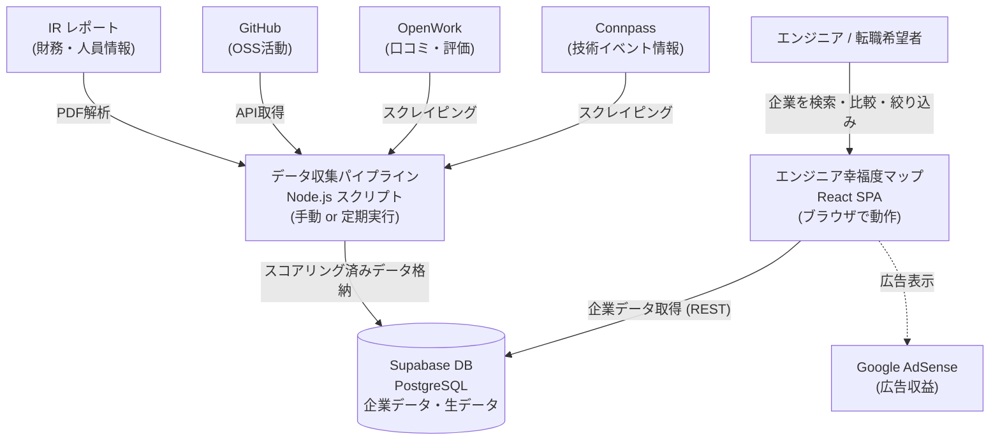

# Business Overview

## Business Context Diagram



Text Alternative:
```
[エンジニア/転職希望者]
    --> (企業検索・比較・絞り込み)
    --> [React SPA: エンジニア幸福度マップ]
           --> (企業データ取得) --> [Supabase DB]
                                        <-- (データ格納) <-- [Node.js パイプライン]
                                                                  <-- Connpass
                                                                  <-- OpenWork
                                                                  <-- GitHub
                                                                  <-- IR レポート
    -.-> [Google AdSense (広告)]
```

## Business Description

**エンジニア幸福度マップ**は、求人データ・口コミ・IRレポートなどの公開情報を収集・スコアリングし、エンジニアが「働きやすい会社」を可視化・比較できるWebサービスです。

- **ユーザー**: 転職検討中のエンジニア
- **提供価値**: 複数の外部情報源をまとめて7指標で数値化し、企業間を客観的に比較できる
- **収益モデル**: Google AdSense（広告）

## System Overview

| レイヤー | 技術 | 役割 |
|---|---|---|
| フロントエンド | React + Vite SPA | 企業一覧・比較・フィルタリングUI |
| データストア | Supabase (PostgreSQL) | 企業データ・生データの永続化 |
| データ収集 | Node.js パイプライン | 外部ソースのスクレイピング・スコア算出 |

## Business Transactions

| トランザクション | 説明 |
|---|---|
| 企業一覧閲覧 | 幸福度スコア順・パーソナルスコア順で企業カード一覧を閲覧する |
| 企業詳細確認 | 選択した企業の7指標スコア内訳・データソースを確認する |
| パーソナライズフィルタ | ユーザーが重視する指標のウェイトを設定し、自分向けランキングを生成する |
| 企業絞り込み | キーワード・リモート率・スコア・タグで企業を絞り込む（本タスクで追加予定） |
| スコア比較（レーダーチャート） | 選択企業のスコアバランスをレーダーチャートで視覚的に比較する |
| ランキング棒グラフ表示 | 幸福度/マッチ度スコア上位企業を棒グラフで一覧表示する |
| データ収集パイプライン | Connpass・OpenWork・GitHub・IRレポートからデータを自動収集しSupabaseに保存する |

## Business Dictionary

| 用語 | 意味 |
|---|---|
| 幸福度スコア | 7指標の重み付き合計（0-100）。エンジニアが幸せに働ける度合いの総合評価 |
| パーソナルスコア | ユーザーが設定した重み付きで再計算したスコア |
| テックスタック現代性 | 1-10スケール。モダンな技術を使っているほど高い |
| リモート率 | 0-100%。フルリモート可ほど高い |
| 推定残業時間 | 月間残業時間（少ないほど高スコア） |
| 離職率 | 低いほど高スコア（反転指標） |
| 定着率 | 高いほど高スコア |
| 開発環境スコア | 1-10スケール |
| スキルアップ支援度 | 1-10スケール |

## Component Level Business Descriptions

### フロントエンド (src/)
- **Purpose**: エンジニア向けの企業幸福度情報の閲覧・比較・絞り込みUI
- **Responsibilities**: スコア表示・チャート描画・パーソナライズフィルタ・企業絞り込み・企業詳細ページ

### データパイプライン (pipeline/)
- **Purpose**: 外部ソースからデータを収集・スコアリングしてSupabaseに格納
- **Responsibilities**: スクレイピング・データ正規化・スコア算出・DB書き込み
