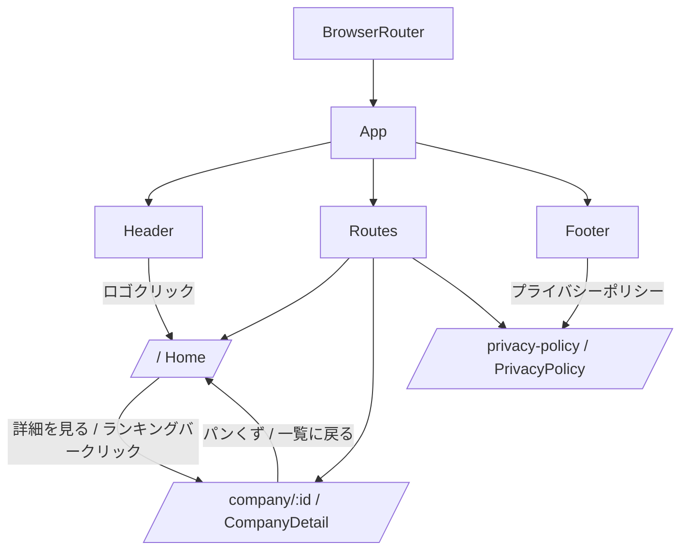
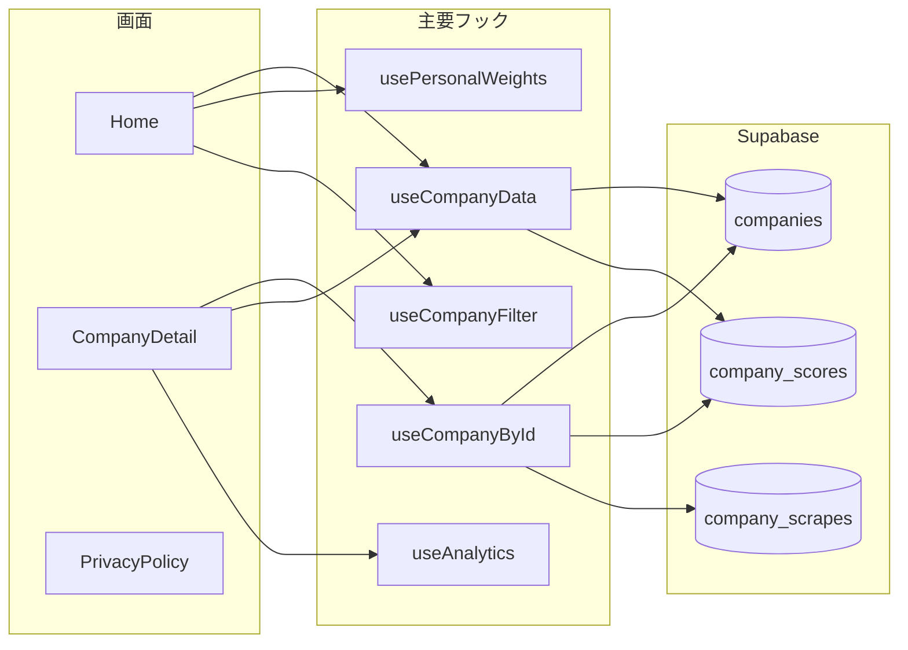

# 画面マップ

React 画面側の構成を、実装から逆引きしたドキュメント。

対象コード:

- `src/App.tsx`
- `src/pages/Home.tsx`
- `src/pages/CompanyDetail.tsx`
- `src/pages/PrivacyPolicy.tsx`
- `src/components/layout/*`

---

## ルーティングと共通レイアウト

---

## 画面とデータ取得の対応

---

## 共通レイアウト仕様

| 項目 | 仕様 |
|---|---|
| ルーター | `BrowserRouter` |
| ヘッダー | 全画面で固定表示。上部 sticky。ロゴクリックで `/` へ遷移 |
| フッター | 全画面で表示。`/` と `/privacy-policy` へのリンクを保持 |
| ページ遅延読込 | `lazy()` + `Suspense`。fallback は全画面スピナー |
| SEO基盤 | `HelmetProvider` を最上位に配置 |

---

## 主要ユーザーフロー

1. 一覧画面を開くと企業一覧、フィルター、ランキングが表示される
2. 企業カードをクリックすると右カラムのレーダーチャート対象が切り替わる
3. `詳細を見る` またはランキングバークリックで詳細画面へ遷移する
4. 詳細画面ではスコア内訳、データ信頼度、シェア導線、関連企業を表示する
5. フッターからプライバシーポリシーへ遷移できる
