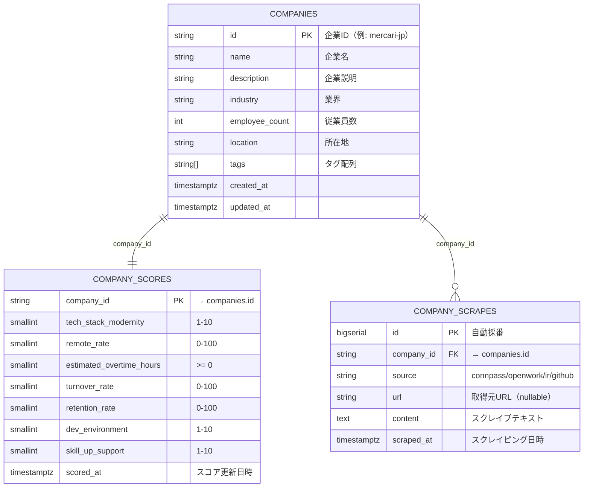
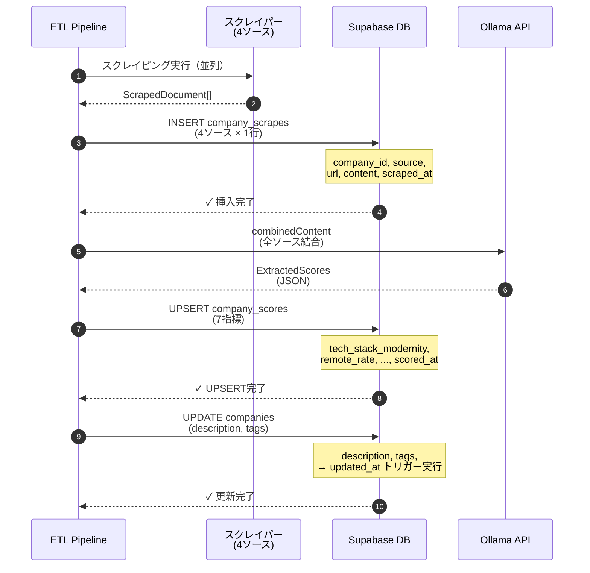
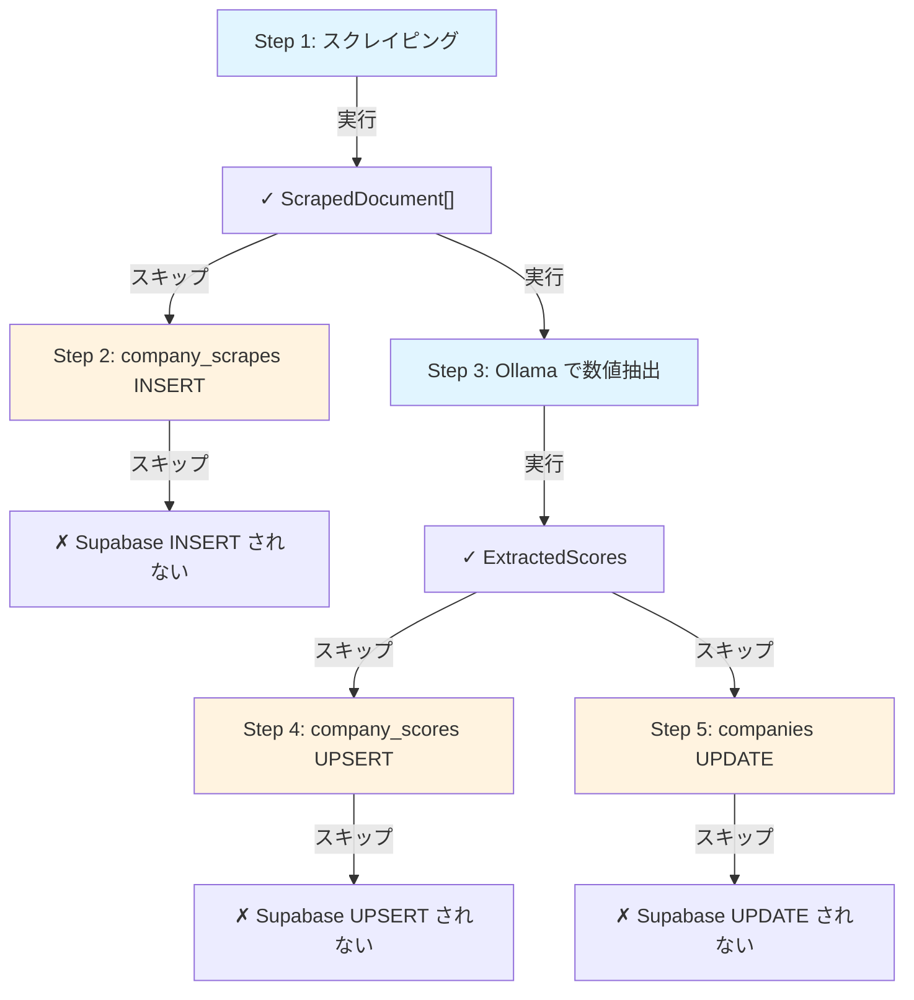

# パイプライン テーブル定義書

Supabase（PostgreSQL）のテーブル設計。スクレイピングデータ・抽出スコアの永続化。

---

## 全体概要



**データフロー**:
1. **seed**: `companies` に企業ID・基本情報を登録、`company_scores` に暫定値を INSERT（一度のみ）
2. **実行時**: パイプライン実行 → `company_scrapes` にスクレイプテキストを INSERT（4ソース）
3. **実行時**: Ollama抽出 → `company_scores` の7指標を UPSERT、`companies` の description/tags を UPDATE

---

## 1. companies テーブル

企業マスタテーブル。基本情報のみを保持（スコアは company_scores テーブルに分離）。

### 1.1 テーブル定義

```sql
CREATE TABLE public.companies (
  id                       TEXT PRIMARY KEY,
  name                     TEXT NOT NULL,
  description              TEXT NOT NULL DEFAULT '',
  industry                 TEXT NOT NULL DEFAULT '',
  employee_count           INTEGER NOT NULL DEFAULT 0,
  location                 TEXT NOT NULL DEFAULT '',
  tags                     TEXT[] NOT NULL DEFAULT '{}',
  created_at               TIMESTAMPTZ NOT NULL DEFAULT now(),
  updated_at               TIMESTAMPTZ NOT NULL DEFAULT now()
);
```

### 1.2 カラム仕様

| カラム | 型 | NOT NULL | デフォルト | 制約 | 説明 |
|---|---|---|---|---|---|
| `id` | TEXT | ✓ | — | PK | 企業ID（例: `mercari-jp`） |
| `name` | TEXT | ✓ | — | — | 企業名（例: `メルカリ`） |
| `description` | TEXT | ✓ | `''` | — | 企業説明 |
| `industry` | TEXT | ✓ | `''` | — | 業界（例: `EC`） |
| `employee_count` | INTEGER | ✓ | `0` | — | 従業員数 |
| `location` | TEXT | ✓ | `''` | — | 所在地 |
| `tags` | TEXT[] | ✓ | `{}` | — | タグ配列（例: `['Go', 'Kubernetes']`） |
| `created_at` | TIMESTAMPTZ | ✓ | `now()` | — | レコード作成日時 |
| `updated_at` | TIMESTAMPTZ | ✓ | `now()` | トリガー | レコード更新日時（自動更新） |

**スコアカラムは company_scores テーブルに移行しました** → [2. company_scores テーブル](#2-company_scores-テーブル)

### 1.3 初期データ

Seed SQL で登録（80+ 企業）。例：

```sql
INSERT INTO public.companies (id, name, industry, location) VALUES
  ('mercari-jp', 'メルカリ', 'EC', '東京'),
  ('cyberagent', 'サイバーエージェント', 'IT・通信', '東京'),
  ...
```

### 1.4 インデックス

```sql
-- 主キーに自動生成
CREATE INDEX idx_companies_id ON public.companies(id);
```

### 1.5 トリガー

`updated_at` 自動更新：

```sql
CREATE OR REPLACE FUNCTION public.set_updated_at()
RETURNS TRIGGER AS $$
BEGIN NEW.updated_at = now(); RETURN NEW; END;
$$ LANGUAGE plpgsql;

CREATE TRIGGER companies_updated_at
  BEFORE UPDATE ON public.companies
  FOR EACH ROW EXECUTE FUNCTION public.set_updated_at();
```

### 1.6 RLS（Row Level Security）

```sql
ALTER TABLE public.companies ENABLE ROW LEVEL SECURITY;

-- 全ユーザーに読み取り許可
CREATE POLICY "Public read access"
  ON public.companies FOR SELECT
  TO anon, authenticated USING (true);
```

---

## 2. company_scores テーブル

企業スコアテーブル（1企業1行）。Ollama抽出後にUPSERT。

### 2.1 テーブル定義

```sql
CREATE TABLE public.company_scores (
  company_id               TEXT PRIMARY KEY
                             REFERENCES public.companies(id) ON DELETE CASCADE,
  tech_stack_modernity     SMALLINT NOT NULL DEFAULT 5  CHECK (tech_stack_modernity BETWEEN 1 AND 10),
  remote_rate              SMALLINT NOT NULL DEFAULT 50 CHECK (remote_rate BETWEEN 0 AND 100),
  estimated_overtime_hours SMALLINT NOT NULL DEFAULT 30 CHECK (estimated_overtime_hours >= 0),
  turnover_rate            SMALLINT NOT NULL DEFAULT 15 CHECK (turnover_rate BETWEEN 0 AND 100),
  retention_rate           SMALLINT NOT NULL DEFAULT 80 CHECK (retention_rate BETWEEN 0 AND 100),
  dev_environment          SMALLINT NOT NULL DEFAULT 5  CHECK (dev_environment BETWEEN 1 AND 10),
  skill_up_support         SMALLINT NOT NULL DEFAULT 5  CHECK (skill_up_support BETWEEN 1 AND 10),
  scored_at                TIMESTAMPTZ NOT NULL DEFAULT now()
);
```

### 2.2 カラム仕様

| カラム | 型 | NOT NULL | デフォルト | 制約 | 説明 |
|---|---|---|---|---|---|
| `company_id` | TEXT | ✓ | — | PK, FK → companies.id | 企業ID |
| `tech_stack_modernity` | SMALLINT | ✓ | `5` | `1–10` | 技術スタックの新しさ（パイプラインで更新） |
| `remote_rate` | SMALLINT | ✓ | `50` | `0–100` | リモートワーク率（パイプラインで更新） |
| `estimated_overtime_hours` | SMALLINT | ✓ | `30` | `≥0` | 月間残業時間（パイプラインで更新） |
| `turnover_rate` | SMALLINT | ✓ | `15` | `0–100` | 離職率（パイプラインで更新） |
| `retention_rate` | SMALLINT | ✓ | `80` | `0–100` | 定着率（パイプラインで更新） |
| `dev_environment` | SMALLINT | ✓ | `5` | `1–10` | 開発環境の良さ（パイプラインで更新） |
| `skill_up_support` | SMALLINT | ✓ | `5` | `1–10` | スキルアップ支援の充実度（パイプラインで更新） |
| `scored_at` | TIMESTAMPTZ | ✓ | `now()` | — | スコア更新日時 |

### 2.3 初期データ

Seed SQL で暫定値を登録（companies と同時に INSERT）。例：

```sql
INSERT INTO public.company_scores (company_id, tech_stack_modernity, remote_rate, estimated_overtime_hours, turnover_rate, retention_rate, dev_environment, skill_up_support) VALUES
  ('mercari-jp', 5, 50, 30, 15, 80, 5, 5),
  ('cyberagent', 5, 50, 30, 15, 80, 5, 5),
  ...
```

### 2.4 RLS（Row Level Security）

```sql
ALTER TABLE public.company_scores ENABLE ROW LEVEL SECURITY;

-- 全ユーザーに読み取り許可
CREATE POLICY "Public read access"
  ON public.company_scores FOR SELECT
  TO anon, authenticated USING (true);
```

---

## 3. company_scrapes テーブル

スクレイピング生テキストの記録（監査証跡・旧 raw_documents）。

### 3.1 テーブル定義

```sql
CREATE TABLE public.company_scrapes (
  id          BIGSERIAL PRIMARY KEY,
  company_id  TEXT NOT NULL REFERENCES public.companies(id) ON DELETE CASCADE,
  source      TEXT NOT NULL CHECK (source IN ('connpass','openwork','ir','github')),
  url         TEXT,
  content     TEXT NOT NULL,
  scraped_at  TIMESTAMPTZ NOT NULL DEFAULT now()
);
```

### 3.2 カラム仕様

| カラム | 型 | NOT NULL | デフォルト | 制約 | 説明 |
|---|---|---|---|---|---|
| `id` | BIGSERIAL | ✓ | (auto) | PK | 自動採番ID |
| `company_id` | TEXT | ✓ | — | FK → companies.id | 企業ID |
| `source` | TEXT | ✓ | — | `IN ('connpass','openwork','ir','github')` | スクレイピングソース |
| `url` | TEXT | ✗ | NULL | — | 取得元URL（失敗時はNULL） |
| `content` | TEXT | ✓ | — | — | スクレイプテキスト（5–50 KB） |
| `scraped_at` | TIMESTAMPTZ | ✓ | `now()` | — | スクレイピング実行日時 |

### 3.3 インデックス

```sql
-- 主キーに自動生成
CREATE INDEX idx_company_scrapes_id ON public.company_scrapes(id);

-- 企業ID・ソース別検索用
CREATE INDEX idx_company_scrapes_company_source 
  ON public.company_scrapes(company_id, source);

-- 日時検索用
CREATE INDEX idx_company_scrapes_scraped_at 
  ON public.company_scrapes(scraped_at DESC);
```

### 3.4 RLS（Row Level Security）

```sql
ALTER TABLE public.company_scrapes ENABLE ROW LEVEL SECURITY;

-- Service role は全操作可能
CREATE POLICY "Service role full access" ON public.company_scrapes
  FOR ALL TO service_role USING (true) WITH CHECK (true);

-- 一般ユーザーは読み取りのみ
CREATE POLICY "Public read" ON public.company_scrapes
  FOR SELECT TO anon, authenticated USING (true);
```

**理由**: スクレイプテキストは監査用なので、外部ユーザーには書き込み禁止。

---

## 4. データの流れ

### 4.1 パイプライン実行時



### 4.2 dry-run 時



---

---

## 5. CHECK 制約一覧

| テーブル | カラム | 制約 | 例 |
|---|---|---|---|
| company_scores | `tech_stack_modernity` | `1 ≤ x ≤ 10` | 8 ✓, 0 ✗, 11 ✗ |
| company_scores | `remote_rate` | `0 ≤ x ≤ 100` | 75 ✓, -1 ✗, 101 ✗ |
| company_scores | `estimated_overtime_hours` | `x ≥ 0` | 20 ✓, -5 ✗ |
| company_scores | `turnover_rate` | `0 ≤ x ≤ 100` | 15 ✓, 101 ✗ |
| company_scores | `retention_rate` | `0 ≤ x ≤ 100` | 85 ✓, 101 ✗ |
| company_scores | `dev_environment` | `1 ≤ x ≤ 10` | 7 ✓, 0 ✗ |
| company_scores | `skill_up_support` | `1 ≤ x ≤ 10` | 8 ✓, 11 ✗ |
| company_scrapes | `source` | `IN ('connpass','openwork','ir','github')` | 'connpass' ✓, 'unknown' ✗ |

---

## 6. パフォーマンス・スケーリング

### 6.1 データ量の見積もり

```
companies:
  - 行数: 80–100
  - 行サイズ: ~200 bytes
  - テーブル総サイズ: ~20 KB

company_scores:
  - 行数: 80–100（companies と 1:1）
  - 行サイズ: ~100 bytes
  - テーブル総サイズ: ~10 KB

company_scrapes:
  - 1企業あたり 4ソース × 月1回 = 4行/月
  - 100社 × 4行 × 12ヶ月 = 4,800 行/年
  - 1行あたり: 5–50 KB（content）
  - テーブル総サイズ: 20–240 MB/年
```

### 6.2 クエリパフォーマンス

```sql
-- 最新スクレイプテキストを取得（高速）
SELECT * FROM company_scrapes 
WHERE company_id = 'mercari-jp' AND source = 'connpass'
ORDER BY scraped_at DESC LIMIT 1;
-- → インデックス idx_company_scrapes_company_source で O(log n)

-- 月単位でスクレイプ履歴を分析
SELECT source, COUNT(*) as cnt, MAX(scraped_at) as latest
FROM company_scrapes
WHERE company_id = 'mercari-jp' 
  AND scraped_at >= now() - interval '1 month'
GROUP BY source;
-- → インデックス idx_company_scrapes_scraped_at で効率的
```

---

## 7. バックアップ・リカバリ

### 7.1 Supabase でのバックアップ

```bash
# 自動バックアップ有効（Supabase Pro 以上）
# 毎日 04:00 UTC に実行

# 手動バックアップ
supabase db push  # ローカルマイグレーションを適用
```

### 7.2 マイグレーションファイル

```
supabase/migrations/
├── 20260405114531_create_companies_table.sql
├── 20260405120000_create_raw_documents.sql
├── 20260405130000_add_github_source.sql
└── 20260407000000_refactor_scores_and_scrapes.sql
```

バージョン管理（Git）で履歴を管理。

---

## 8. スキーマの変更履歴

### 8.1 リリース 1.0 (2026-04-05)

```sql
-- companies テーブル作成（スコアカラムを含む）
CREATE TABLE public.companies (...)

-- raw_documents テーブル作成
CREATE TABLE public.raw_documents (...)
```

### 8.2 リリース 2.0 (2026-04-07) - テーブル再構成

```sql
-- company_scores テーブル作成（スコア分離）
CREATE TABLE public.company_scores (...)

-- companies テーブルからスコアカラム削除
ALTER TABLE public.companies DROP COLUMN ...

-- raw_documents → company_scrapes にリネーム
ALTER TABLE public.raw_documents RENAME TO company_scrapes
```

### 8.3 リリース 1.1 (2026-04-05)

```sql
-- GitHub ソースを source CHECK 制約に追加
ALTER TABLE public.raw_documents
DROP CONSTRAINT raw_documents_source_check;

ALTER TABLE public.raw_documents
ADD CONSTRAINT raw_documents_source_check 
  CHECK (source IN ('connpass', 'openwork', 'ir', 'github'));
```

---

## 9. 監視・運用

### 9.1 ストレージ使用量

```sql
-- テーブル別サイズ確認
SELECT 
  tablename,
  pg_size_pretty(pg_total_relation_size(schemaname || '.' || tablename)) as size
FROM pg_tables
WHERE schemaname = 'public'
ORDER BY pg_total_relation_size(schemaname || '.' || tablename) DESC;
```

### 9.2 スクレイプ実績の確認

```sql
-- 過去7日間のスクレイプ実績
SELECT 
  source,
  COUNT(*) as count,
  MAX(scraped_at) as latest,
  COUNT(DISTINCT company_id) as companies
FROM company_scrapes
WHERE scraped_at >= now() - interval '7 days'
GROUP BY source
ORDER BY source;
```

### 9.3 スコア更新の確認

```sql
-- 過去30日間に更新されたスコア
SELECT 
  cs.company_id, c.name, cs.scored_at,
  cs.tech_stack_modernity, cs.remote_rate, cs.dev_environment
FROM company_scores cs
JOIN companies c ON c.id = cs.company_id
WHERE cs.scored_at >= now() - interval '30 days'
ORDER BY cs.scored_at DESC;
```

---

## 10. トラブルシューティング

### Q: company_scrapes INSERT が失敗する場合は？

**エラー**: `FOREIGN KEY constraint failed`

**原因**: `company_id` が `companies` テーブルに存在しない

**解決**: 
```sql
SELECT id FROM companies WHERE id = 'xxxxx';
-- 結果が空の場合、seed でデータを追加
INSERT INTO companies (id, name, ...) VALUES (...);
```

### Q: company_scores UPSERT が CHECK 制約エラーになる場合は？

**エラー**: `new row for relation "company_scores" violates check constraint`

**原因**: スコア値が範囲外（例: `tech_stack_modernity = 11`）

**解決**: Ollama バリデーション側で異常値を null に変換して回避（設計仕様）

### Q: updated_at が更新されない場合は？

**確認**:
```sql
-- トリガーが存在するか確認
SELECT * FROM pg_trigger WHERE tgname = 'companies_updated_at';

-- トリガー関数が存在するか確認
SELECT * FROM pg_proc WHERE proname = 'set_updated_at';
```

---

## 10. セキュリティ

### 10.1 RLS ポリシー

- `companies`: 全員読み取り可（public）
- `raw_documents`: 全員読み取り可、service_role のみ書き込み可

### 10.2 認証

Supabase のサービスロール認証でパイプラインから書き込み：

```typescript
const supabase = createClient(
  process.env.SUPABASE_URL,
  process.env.SUPABASE_KEY  // ← service_role key
)
```

