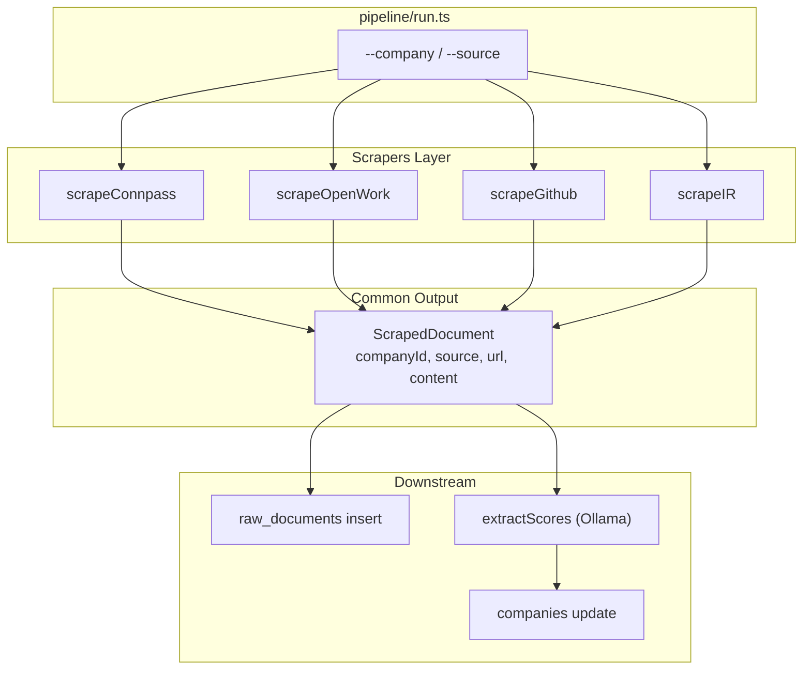

# Scrapers Architecture

このディレクトリは、企業ごとに外部ソースをスクレイピングして、
共通フォーマット `ScrapedDocument` を返す責務を持ちます。

## Overview



## 各 Scraper の責務

### connpass.ts
- 入力: `companyId`
- 主な処理:
  - 企業IDから Connpass グループを引く（`CONNPASS_GROUP_MAP`）
  - グループページ取得に失敗した場合は検索ページにフォールバック
  - イベント件数・平均定員・技術タグを抽出して `content` に整形
- 出力: `source: "connpass"` の `ScrapedDocument`

### openwork.ts
- 入力: `companyId`, `acceptTos`
- 主な処理:
  - `--accept-tos` がない場合は即時エラー
  - `OPENWORK_URL_*` / `OPENWORK_URL_MAP` / `OPENWORK_ID_MAP` から候補URLを解決
  - `OPENWORK_COOKIE` を使ってページ取得し、評価指標・口コミを抽出
  - 取得失敗時も理由付きの `content` を返す
- 出力: `source: "openwork"` の `ScrapedDocument`

### github.ts
- 入力: `companyId`
- 主な処理:
  - `GITHUB_ORG_MAP` から org 名を解決
  - GitHub API で org / repos / events を取得
  - 技術スタックのモダン度と開発環境スコアを推定
  - 上位リポジトリ一覧を `content` に整形
- 出力: `source: "github"` の `ScrapedDocument`

### ir.ts
- 入力: `companyId`
- 主な処理:
  - `IR_URL_MAP` から IR URL を解決
  - ページの取得可否を判定し、結果を `content` に整形
  - 詳細抽出は未実装（到達性チェック中心）
- 出力: `source: "ir"` の `ScrapedDocument`

## 共通インターフェース

`pipeline/types.ts` の `ScrapedDocument` を返却し、`pipeline/scrapers/index.ts` のレジストリに登録します。

- `companyId`: 対象企業ID
- `source`: `connpass | openwork | ir | github`
- `url`: 取得元URL（不明時は `null`）
- `content`: 後段の LLM 抽出用に整形したテキスト

## 拡張手順

1. 新しいソースを `SourceType` とDBの許可値に追加する。
2. `(companyId: string) => Promise<ScrapedDocument>` を満たすスクレイパーを作る。
3. 成功時は `companyId`、正しい `source`、取得元 `url`（不明なら `null`）、LLM向けの `content` を必ず返す。
4. `createScraperRegistry()` に `ScraperDefinition` を登録する。
5. ネットワーク・パース・規約エラーは、既存スクレイパーの方針に従い取得不可の理由を `content` に残すか、再試行可能なエラーとしてthrowする。パイプラインはソース単位で捕捉し、非dry-runでは失敗を終了コードに反映する。

最小のアダプター例:

```ts
const example: ScraperDefinition = {
  source: 'github',
  description: 'Example source adapter',
  scrape: async (companyId) => ({
    companyId,
    source: 'github',
    url: 'https://example.com/data',
    content: '企業ID: ' + companyId,
  }),
}
```

契約テストは [`index.test.ts`](./index.test.ts) で、内蔵ソースの登録、アダプター出力、必須項目の検証を確認します。

## 実行フロー（run.ts との関係）

1. `pipeline/run.ts` が `--source` の各スクレイパーを呼び出す
2. 各スクレイパーが `ScrapedDocument` を返す
3. `raw_documents` に保存
4. 全ソースの `content` を結合して Ollama に渡し、スコアを抽出
5. 抽出結果を `companies` に反映

## Note

- `openwork.ts` は利用規約確認フラグ（`--accept-tos`）を必須にしています。
- `.env` ではなく `pipeline.env` を読み込む設計です（`pipeline/run.ts`）。
